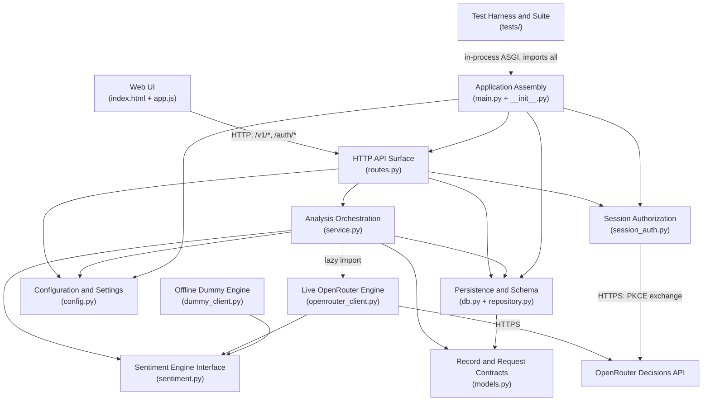
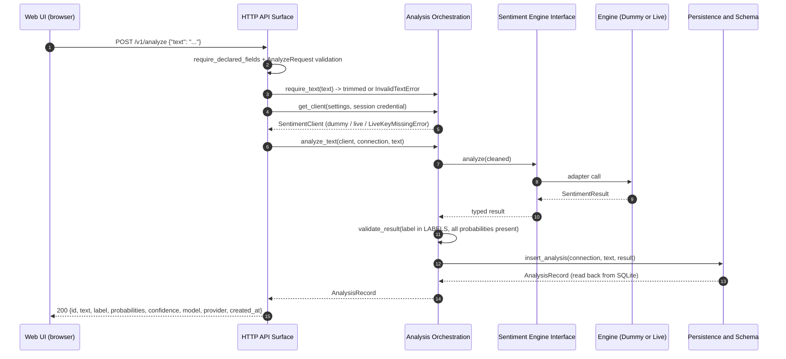
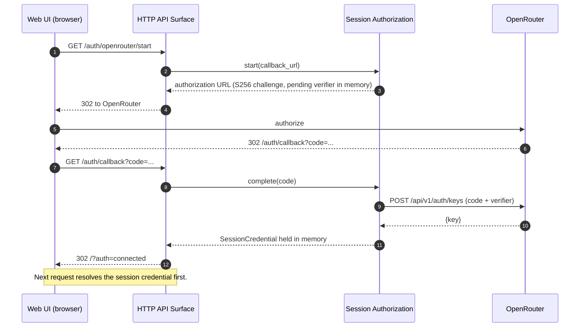
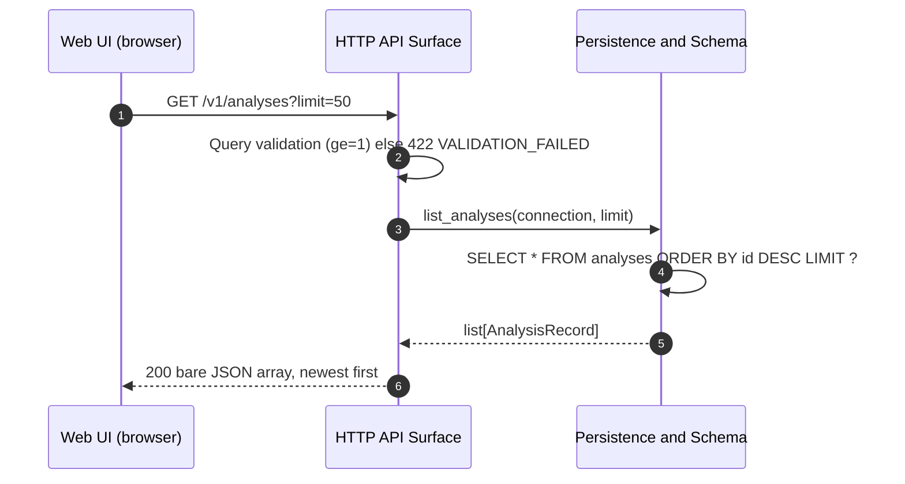

# Architecture — `sentiment-opencode`

> Synthesized from the developer scan at HEAD
> `4eb9b74c4197114181dab641c177c569f2058c24` and verified against the source.
> Component names below match `component-inventory.md` headings verbatim.

## System Overview

`sentiment-opencode` is a single-process, localhost-only **modular monolith**.
One ASGI application (`app.main:app`, built by `create_app()`) serves an HTML
page, a versioned JSON API under `/v1`, a small set of unversioned page-support
routes under `/auth/*`, and static assets. All durable state is one SQLite file.
Sentiment is produced behind a one-method Protocol with two interchangeable
adapters: a deterministic offline keyword engine (default) and an opt-in live
Jev/OpenRouter engine. Everything the app is made of is a Python module in one
flat package, `app/`.

The application is deliberately small: ~2,194 source lines across 12
`app/*.py` modules and 2 static files, plus ~2,303 lines across 11 test files.

## Architectural Style

**Layered modular monolith with one hexagonal seam.**

- Evidence for *layered*: `app/` is a flat by-layer package whose import graph is
  acyclic and one-directional — leaves (`config.py`, `models.py`, `db.py`,
  `sentiment.py`) → data/engine adapters (`repository.py`, `dummy_client.py`,
  `openrouter_client.py`) → service (`service.py`) → routes (`routes.py`) →
  assembly (`main.py`) → shim (`__init__.py`).
- Evidence for *hexagonal seam*: the `SentimentClient` Protocol
  (`app/sentiment.py:78-84`) is the one abstraction the domain depends on; two
  adapters implement it, and the single place a concrete engine is chosen is
  `service.get_client` (`app/service.py:72-90`). Replacing the engine touches no
  route, repository or page code.
- Evidence against *microservices / serverless*: one process, one database file,
  no containers, no network boundaries between components, only two runtime
  dependencies.

## Component Relationships



Text fallback: Web UI → HTTP API Surface → Analysis Orchestration →
Sentiment Engine Interface ← {Offline Dummy Engine, Live OpenRouter Engine}.
HTTP API Surface also uses Persistence and Schema, Configuration and Settings,
and Session Authorization. Analysis Orchestration lazily imports the Live
OpenRouter Engine. Application Assembly wires the HTTP API Surface, Persistence
and Schema, Configuration and Settings and Session Authorization, then exposes
`app`. The Test Harness and Suite drives Application Assembly in-process. Live
OpenRouter Engine and Session Authorization are the only components that leave
the machine (hardcoded HTTPS to OpenRouter).

## Layering and Dependency Direction

| Layer | Modules | May depend on |
|---|---|---|
| Contracts / leaves | `config.py`, `models.py`, `db.py`, `sentiment.py` | stdlib only (plus `models` from `db`) |
| Adapters | `repository.py`, `dummy_client.py`, `openrouter_client.py` | leaves + `sentiment` |
| Orchestration | `service.py` | leaves + adapters + `session_auth` |
| Edge | `routes.py` | orchestration + leaves + `session_auth` |
| Assembly | `main.py`, `__init__.py` | all of the above |
| Presentation | `static/index.html`, `static/app.js` | HTTP API Surface over HTTP only |
| Verification | `tests/` | all application components (in-process) |

Ownership rules that follow: only Analysis Orchestration chooses an engine; only
Persistence and Schema writes SQL; only the HTTP API Surface maps a domain error
to a status and the error envelope; secrets live only in `Settings` and
`SessionCredential`, both key-redacting.

## Data Flow

1. **Write path (one analysis).** Browser `POST /v1/analyze {"text": "..."}` →
   `require_declared_fields` refuses undeclared body keys → `AnalyzeRequest`
   validates presence/type → `require_text` trims and rejects empty →
   `get_client` resolves the engine (session credential → configured live key →
   dummy; a live request without a key raises) → `client.analyze(text)` →
   `validate_result` → `repository.insert_analysis` serialises probabilities as
   a JSON object and writes an ISO-8601 UTC `created_at` → the row is read back
   and returned as `AnalysisRecord.to_dict()`.
2. **Read path (history).** `GET /v1/analyses?limit=N` → one per-request
   connection → `list_analyses` selects `ORDER BY id DESC LIMIT ?` → records
   mapped `from_row`.
3. **Connection state.** `GET /health`, `GET /auth/status` and the startup log
   all read the single `effective_connection(settings, credential, reason)`
   payload, so the indicator and the engine in use cannot disagree.
4. **Live authorization (out of band).** `GET /auth/openrouter/start` 302s to
   OpenRouter with a PKCE S256 challenge; `GET /auth/callback?code=...`
   exchanges the code for a key held in process memory; `POST /auth/disconnect`
   drops it. No credential ever reaches disk.

## Data Storage

One SQLite file, default `data/sentiment.db`. `init_db` runs at startup, in one
transaction: create `analyses` at the current shape if absent, otherwise migrate
in place (add any missing column nullable, then rebuild with the v1 DDL and copy
every row), create `schema_meta`, and upsert `version = SCHEMA_VERSION`.
`ANALYSES_COLUMNS` pins the physical column order; `_is_v1_shape` compares the
tuple, the NOT NULL flags and the label `CHECK`, so any drift triggers a rebuild.
The retired `intensity` column is retained but nullable and never read.

## Key Design Decisions

| # | Decision | Consequence / implication |
|---|---|---|
| D1 | One `SentimentClient` Protocol, two adapters, one selection point | Engine is swappable; routes/repository/page untouched (NFR5) |
| D2 | Offline dummy engine is the default; live is opt-in per config | App and suite work with no network or key |
| D3 | Data API versioned at `/v1`; page/support routes unversioned | A stable data contract without versioning page assets |
| D4 | stdlib `sqlite3` and stdlib `urllib`; exactly two runtime deps | Dependency cap honoured; no ORM, no HTTP client, no multipart parser |
| D5 | Per-request SQLite connection created in a FastAPI sync dependency | Simple lifecycle; carries the accepted thread-affinity risk (R-01) |
| D6 | Domain exceptions at the core, HTTP mapping only at the edge | One error envelope for everything the app raises |
| D7 | Single-page static UI, no bundler or framework | No build step; browser script is not unit-executed |
| D8 | Session credential in process memory, key-redacting `__repr__` | No secret on disk; restart drops the connection |

## Improvement Opportunities

Boundary-level observations only (this stage diagnoses; it does not redesign):

- **Record contract is written four times** (`RECORD_FIELDS`, the
  `AnalysisRecord` fields, `to_dict()`, and `ANALYSES_COLUMNS` + DDL), kept
  aligned only by tests. Single-sourcing it would make an `import_id` addition a
  one-place change; until then every copy must be threaded.
- **Batch semantics do not exist.** `analyze_text` writes nothing and raises on
  the first failure; there is no cross-row transaction boundary. Any bulk
  endpoint must define skip-vs-abort and partial-`import_id` behaviour.
- **`schema_meta.version` is written but never compared**; migration is driven by
  physical shape. A version-aware migration path would make the recorded value
  meaningful.
- **`app/static/app.js` has no executable test**; only served markup is pinned.
- **No dependency/secret audit and no lockfile**; declared floors resolve newest
  compatible versions on every install.

## Interaction Diagrams

### 1. Analyst submits one text and reads the stored record



Text fallback: Browser → HTTP API Surface (`POST /v1/analyze`) → Analysis
Orchestration validates text and resolves the engine via the Sentiment Engine
Interface → the concrete adapter returns a `SentimentResult` → the result is
validated → Persistence and Schema inserts the row and reads it back → the HTTP
API Surface returns the stored record as `200`.

Failure branches: empty text → `422 INVALID_TEXT` before the engine is resolved;
undeclared body key → `422 VALIDATION_FAILED`; live mode requested with no key →
`503 LIVE_KEY_MISSING`; engine failure → `503 SENTIMENT_ENGINE_ERROR`; OpenRouter
rejects the key → `503 AUTH_EXPIRED` and the session credential is dropped.

### 2. In-app OpenRouter connection (PKCE)



Text fallback: Browser requests `/auth/openrouter/start`; Session Authorization
mints a verifier, returns a 302 to OpenRouter; after the user authorizes,
`/auth/callback?code=...` triggers `complete()`, which exchanges the code for a
key and holds it in memory; the browser is redirected to `/?auth=connected`. A
later `401/403` from OpenRouter drops the credential and the app falls back to
the offline engine.

### 3. Application startup, schema readiness and migration

```mermaid
sequenceDiagram
    autonumber
    participant U as uvicorn
    participant M as Application Assembly
    participant CFG as Configuration and Settings
    participant A as Session Authorization
    participant D as Persistence and Schema
    U->>M: import app:app / start lifespan
    M->>CFG: load_settings(config_path, db_path)
    CFG-->>M: Settings (mode, key redacted, db_path)
    M->>D: init_db(db_path)
    D->>D: BEGIN; create table or migrate in place; record schema version; COMMIT
    D-->>M: ready (or loud rollback + raise)
    M->>A: credential()/reason()
    M->>M: effective_connection(...)
    M->>U: one startup log line: mode (+ "not connected")
```

Text fallback: `uvicorn` starts the app; Application Assembly resolves settings
from Configuration and Settings, asks Persistence and Schema to create or
migrate the database in one transaction, reads connection state from Session
Authorization, then logs the active mode exactly once and serves requests.

### 4. History read



Text fallback: the browser requests `/v1/analyses?limit=N`; the HTTP API Surface
validates `limit`, Persistence and Schema selects newest-first, and the API
returns a bare JSON array. A non-numeric or `< 1` limit is refused `422`, never
silently clamped.
