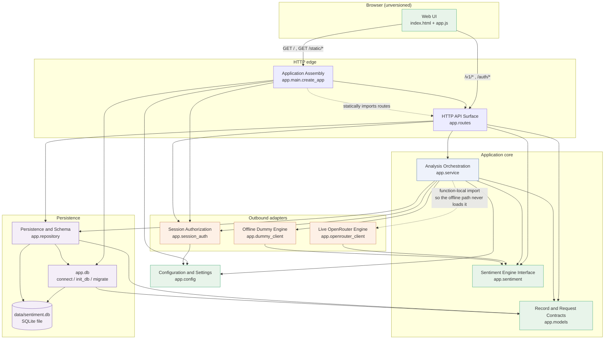
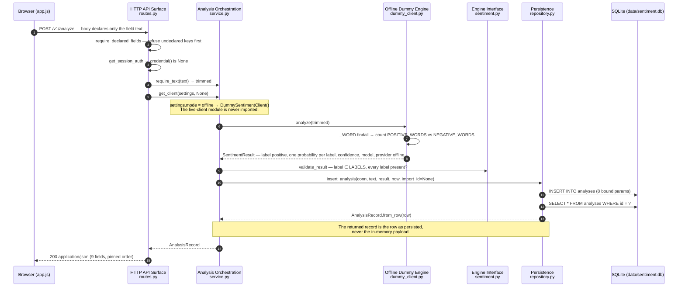
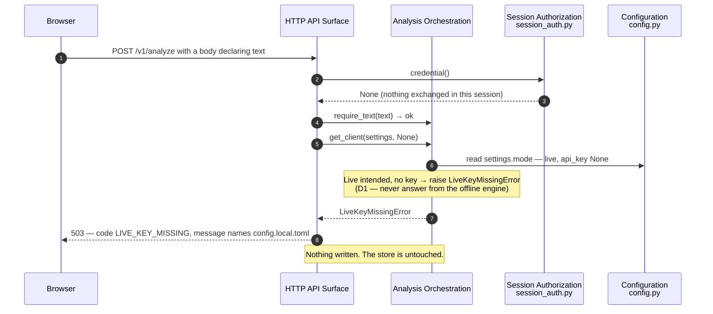
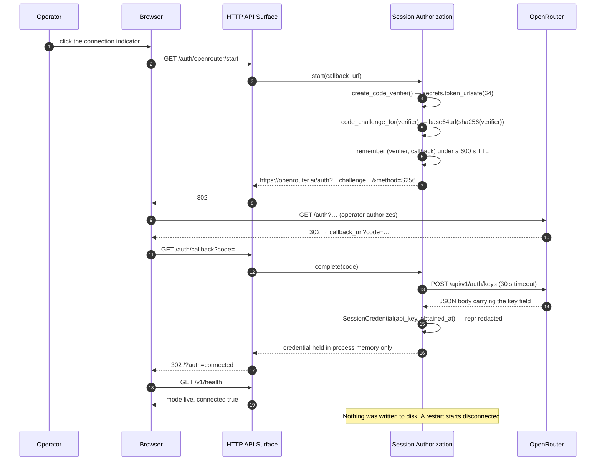
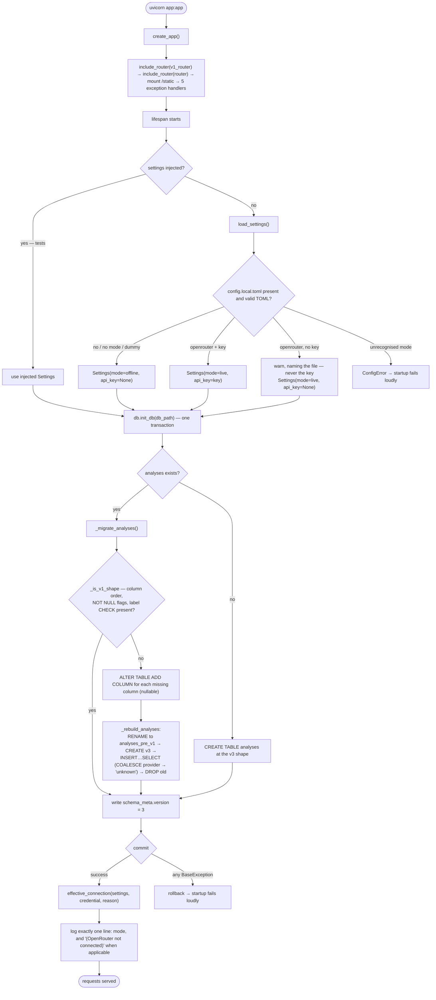

# Architecture — `very-cool-sentiment-analysis` (repo `sentiment-opencode`)

## System Overview

One process. One ASGI application. One local SQLite file. A page and a versioned
JSON API over the same store, with a sentiment engine behind a single typed
interface that has two adapters — an offline keyword engine (default) and a live
OpenRouter/Jev client (opt-in). Nothing in the system talks to anything except
SQLite on the local filesystem, the browser, and — only in live mode — OpenRouter
over HTTPS.

```
uvicorn → app:app → FastAPI
                     ├── lifespan: load_settings() → db.init_db() → log mode once
                     ├── /v1 router      (data contract)
                     ├── /  router       (page + /auth/*)
                     ├── /static mount   (StaticFiles)
                     └── 5 exception handlers → one error envelope
```

## Architectural Style

**Modular monolith, layered by technical role, with hexagonal seams at the two
points that touch the outside world.**

Evidence for the style call:

| Observation | Evidence |
|---|---|
| Single deployable, single process, single store | `app/main.py` builds one `FastAPI`; `README.md` documents one local run command; no Dockerfile, no compose file, no service manifests |
| No network boundary at all | The only outbound calls are the two OpenRouter calls (`app/openrouter_client.py:34`, `app/session_auth.py:40-41`), both optional and both behind `urllib` in production |
| Layering is by technical role, not by feature | `app/` is a flat by-layer package: `config`/`models`/`sentiment` → `repository`/`db`/`dummy_client`/`openrouter_client`/`session_auth` → `service` → `routes` → `main` |
| The seams are explicit Ports-and-Adapters | `SentimentClient` (`app/sentiment.py:78`) is a `runtime_checkable` `Protocol`; `HttpTransport` (`app/openrouter_client.py:69`) is a second one; the concrete client is chosen in exactly one function, `get_client` (`app/service.py:76`) |
| Connections are owned at the edge | Only `app/routes.py:92-98` touches the `sqlite3` driver and the connection lifecycle; `service` and `repository` receive a connection as an argument |

The layering is a **strict descending chain with no cycles**. Nothing in a lower
layer imports anything from a higher one; the internal adjacency table is in
**dependencies.md**.

## Component Relationships



## Layering and Boundary Rules

Each rule below is enforced by the code's structure, not by a comment.

| Rule | Enforced by | What it buys |
|---|---|---|
| No SQL in the HTTP layer | `app/routes.py` imports `app.db` only for `connect`; every statement lives in `app/repository.py` or `app/db.py` | The route layer can be rewritten without touching persistence. |
| No HTTP in the core | `app/service.py` imports nothing from `fastapi` | The orchestration is callable from a test, a script or a future CLI without a request object. |
| The engine is reached only through the protocol | `app/service.py` holds a `SentimentClient`; `get_client` is the sole construction site | A third engine is one new adapter. Routes, repository and page are untouched. |
| Connections are created and closed at one place | `get_connection` (`app/routes.py:92`) | Connection lifetime, and its known thread-affinity defect, are confined to one function. |
| The live client module is never loaded offline | `from app.openrouter_client import …` sits *inside* `_live_client` (`app/service.py:103`) | An offline run cannot fail on a live-client import, and the offline test suite never imports the module that performs HTTP. |
| Validation happens before resolution, not after | `analyze_text` calls `require_text` first (`app/service.py:211`), and the route calls `require_text` before `get_client` (`app/routes.py:161-162`) | An empty submission is invalid input even when live mode is also unconfigured — one code path, one envelope, no ambiguity. |
| One envelope builder | `error_response(status_code, code, message)` (`app/routes.py:69`) | The envelope cannot drift, because there is exactly one construction site. |

## Data Flow

### Write path (one submitted text → one stored row)

1. `POST /v1/analyze` — `require_declared_fields` rejects an undeclared body key
   **before** the body validator runs (`app/routes.py:101-127`).
2. `require_text` trims and rejects empty/whitespace-only text
   (`app/service.py:112`).
3. `get_client(settings, credential)` picks the engine in one of three orders
   (`app/service.py:76-92`).
4. `client.analyze(text)` returns a typed `SentimentResult`.
5. `validate_result` checks the label is in `LABELS` and that a probability
   exists for every label (`app/sentiment.py:57`).
6. `insert_analysis` writes the row, serialises `probabilities` to JSON, stamps
   `created_at` from an injectable `now` (`app/repository.py:39-70`).
7. The handler returns a record **read back out of the database**
   (`app/repository.py:67-69`), not the in-memory payload.

### Read path

`get_connection` opens one short-lived connection per request; the repository
runs a single parameter-bound `SELECT`, `AnalysisRecord.from_row` decodes the
encodings, and the handler calls `to_dict()`.

### Startup

`create_app`'s `lifespan` resolves settings (or takes the injected ones), builds
the session store, calls `db.init_db` inside one transaction, computes
`effective_connection`, and logs exactly one startup line naming the mode. A
failure in any of those stops startup loudly.

## Key Design Decisions

Each entry is the observed decision, its alternatives, and its consequence for
anyone extending this system. Identifiers `D1`–`D4` and `W1` are the ones the
code itself cites.

### D3 — Data routes are versioned under `/v1`; page and auth routes are not

**Decision.** `V1_PREFIX = "/v1"` (`app/routes.py:49`) on `v1_router`
(`app/routes.py:134`), included at `app/main.py:90` alongside an unprefixed
`router` carrying `/`, `/auth/*` and the asset mount.

**Alternatives.** One unprefixed router (rejected — the README's own rule is
that data routes carry a contract and must be versionable); version *everything*
including `/` and `/auth/*` (rejected — those carry no data contract, so a
version prefix on them would promise a stability that does not exist).

**Consequence.** The two-router split is the established insertion point for a
new data router. A new data surface gets its own `APIRouter(prefix=…)` and one
`include_router` line; a new page goes on the **unprefixed** router beside
`index()` and is served the same way.

### D1 — A live request with no usable key is refused, never silently answered offline

**Decision.** `get_client` raises `LiveKeyMissingError` when `mode == "live"` and
no key exists (`app/service.py:88-92`); the handler maps it to
`503 LIVE_KEY_MISSING` naming the config file (`app/routes.py:363`).

**Alternatives.** Fall back to offline (rejected — the operator would get a
confident keyword-engine answer and believe a model produced it); crash at
startup (rejected — the app must stay usable while the key is being supplied,
which the in-app PKCE flow makes routine).

**Consequence.** Two states, not one: *offline intended* and *live intended,
not yet connected*. The page indicator is the operator's only cue, and it is
driven by the same function the health endpoint reads.

### D2 — A bad `limit` is refused, not clamped

**Decision.** `limit: int = Query(DEFAULT_LIST_LIMIT, ge=1)`
(`app/routes.py:168`) with `DEFAULT_LIST_LIMIT = 50`
(`app/repository.py:26`); the validation handler turns the refusal into
`422 VALIDATION_FAILED` naming `query.limit`.

**Alternatives.** Clamp silently (rejected — a caller asking for `limit=0` would
receive rows it did not ask for and could not detect the substitution).

### D4 — The outbound call's timeout is bounded in exactly one place

**Decision.** `LIVE_TIMEOUT_SECONDS = 10.0` (`app/openrouter_client.py:38`),
passed to `urllib.request.urlopen`. The authorization exchange has its own
`EXCHANGE_TIMEOUT_SECONDS = 30.0` (`app/session_auth.py:53`), matching the
browser round-trip it sits inside.

**Consequence.** No outbound call can hang a worker thread indefinitely, and the
two timeouts are separately tunable because they cover different journeys.

### W1 — The fixed order: validate → resolve engine → answer → validate answer → store

**Decision.** Enforced twice (`app/routes.py:161-162` and
`app/service.py:211-213`) so the boundary holds whether the caller is the route
or the bulk importer.

**Consequence.** A refused request never reaches the engine and never writes a
row. A future endpoint that calls `analyze_text` inherits this order for free.

### A1 — The record contract is stdlib `dataclass`, deliberately not pydantic

**Decision.** `AnalyzeRequest` and `AnalysisRecord` (`app/models.py`) are plain
frozen/simple dataclasses; the codebase contains no direct `pydantic` import.
FastAPI accepts a dataclass as a request body, so nothing is lost.

**Alternatives.** Pydantic models (rejected — it would add a direct
application-code dependency on the validation library FastAPI happens to use
internally, which the two-package runtime cap forbids); TypedDict (rejected — no
runtime validation, no defaults, no `fields()` derivation for
`undeclared_body_fields`).

**Consequence — and the cost.** Because there is no response model, handlers
return bare `dict[str, object]` / `list[dict[str, object]]` / hand-built
`JSONResponse`, so FastAPI's generated `/openapi.json` **cannot describe the real
shapes**. Contracts are pinned only by hand-written constants in the tests. See
**code-quality-assessment.md** TD-8.

### A2 — One store, one connection lifetime, no pooling

**Decision.** `get_connection` opens and closes a connection per request
(`app/routes.py:92-98`); `db.connect` creates the parent directory on demand and
sets `row_factory = sqlite3.Row` (`app/db.py:130-142`).

**Consequence.** No pool state, no stale connection, trivially correct for
sequential single-user use — and the source of the accepted cross-thread defect
recorded in **code-quality-assessment.md** TD-5. **Any new endpoint that uses
`get_connection` inherits that defect**, which matters because a polling
analytics page is precisely the access pattern that exposes it.

### A3 — Aggregates that can be empty answer `null`, never a fabricated zero

**Decision.** `ImportSummary.mean_confidence` is `float | None` and is `None`
when nothing was imported (`app/service.py:129-131`), so an empty range has no
division by zero and no misleading `0.0`. `label_counts` is pre-seeded from
`LABELS` so zeros are present rather than absent.

**Consequence.** An aggregate over an empty date range should follow this
precedent — report `null` for a mean that has no inputs, and include zero-valued
buckets for a closed label set. This is the in-repo precedent an analytics
contract should match.

## Coupling Analysis

| Module | Fan-in (imported by) | Fan-out (imports) | Risk |
|---|---|---|---|
| `app/routes.py` | 1 (`main`) | 7 | **Highest fan-out and the largest module.** It is the assembly surface for HTTP. Any new endpoint lands here by default, so the file's growth is the metric to watch. |
| `app/service.py` | 2 (`main`, `routes`) | 6 | The orchestration hub. Holds the only concrete-client construction site, which is deliberate. |
| `app/config.py` | 3 (`main`, `routes`, `service`) | 0 | A leaf with high fan-in. Correct shape: a leaf depends on nothing. |
| `app/sentiment.py` | 4 (`main`, `routes`, `service`, `repository` via `TYPE_CHECKING`) | 0 | A leaf with the highest fan-in. Correct shape. |
| `app/session_auth.py` | 3 (`main`, `routes`, `service`) | 0 | A leaf. Holds its own outbound call rather than reusing the live client's transport — a deliberate duplication with a shared-shape cost. |
| `app/dummy_client.py` | 1 (`service`) | 1 | Smallest adapter. Also the accidental home of the only tokenizer in the repo. |
| `app/openrouter_client.py` | 0 statically (function-local import from `service`) | 1 | Effectively a leaf, loaded on demand. |
| `app/repository.py` | 2 (`routes`, `service`) | 1 | Owns all DML. |
| `app/db.py` | 2 (`main`, `routes`) | 1 | Owns all DDL and the migration. |
| `app/main.py` | 1 (`__init__`) | 6 | The composition root. |
| `app/models.py` | 4 (`routes`, `service`, `repository`, `db`) | 0 | A leaf. Shared contract type — deliberately depended upon by four modules. |

**No cycles exist.** Verified across the full internal import graph.

Two coupling shapes are worth naming because they are deliberate and because
both are visible in the extension plan:

- `session_auth` and `openrouter_client` each build their own
  `urllib.request` request. They could share one HTTP helper. They do not,
  because each module's stated single responsibility is "nothing else" and
  neither is allowed to import the other. This is **cohesion chosen over DRY**,
  and it is the reason both `urllib` bodies are uncovered (TD-9).
- `repository` reaches `SentimentResult` only under `TYPE_CHECKING`
  (`app/repository.py:22-23`), so the persistence layer has no runtime
  dependency on the engine abstraction at all.

## Extension Seams

The four points a new capability plugs into, and what each one costs. This is the
section the active intent's design should be read against.

| Seam | What it is | Cost to use it | State |
|---|---|---|---|
| **Router seam** | `router` / `v1_router` in `app/routes.py:131-134`, included at `app/main.py:90-91` | Add a handler, plus an exception-handler entry only if a new exception type is introduced | The established two-router convention. A third prefix means a third `APIRouter` plus one `include_router` line — **it does not exist yet** |
| **Persistence seam** | `app/repository.py` is the only module that issues DML, and all three of its functions take a `sqlite3.Connection` as their first argument | Add a function; no other layer changes | **No aggregate query exists anywhere in the codebase.** Aggregates have a natural, uncontested home here |
| **Engine seam** | `SentimentClient` (`app/sentiment.py:78`) + `get_client` (`app/service.py:76`) | Implement one method | Already correct for the intent, which does not need a new engine |
| **Schema seam** | `app/db.py` — `SCHEMA_VERSION`, `CREATE_ANALYSES_TABLE`, `_ADD_COLUMN_SQL`, `_rebuild_analyses`, all run from `init_db` on every startup | Adding a **column** is a five-place edit; adding a **separate table** is one DDL statement | See TD-1 and TD-2 in **code-quality-assessment.md** — in particular, an index added to `CREATE_ANALYSES_TABLE` **does not survive the rebuild** |

**Aggregate-query surface, verified on the bundled SQLite.** `label` is TEXT
under a `CHECK` domain, `confidence` is REAL, and `created_at` is ISO-8601 UTC
ending in `Z` — therefore lexicographically sortable and directly
range-comparable as a string, with no date parsing needed for a
`BETWEEN`-style filter. `import_id` is a plain TEXT grouping key already
queryable through `list_analyses_by_import_id`. The bundled library is SQLite
`3.53.4` and `json_extract` and `strftime('%Y-%m-%d', …)` were both confirmed
available, so the `probabilities` JSON column and per-day bucketing are
reachable without new dependencies. Library versions are pinned in
**technology-stack.md**.

## Interaction Diagrams

### Sequence 1 — Analyse one text, offline (the default path)



### Sequence 2 — Live mode requested, no usable key (the refusal path)



### Sequence 3 — In-app PKCE connection (the only browser round trip)



### Sequence 4 — Bulk CSV import (the aggregate precedent)

```mermaid
sequenceDiagram
    autonumber
    participant B as Browser / curl
    participant R as HTTP API Surface
    participant S as Analysis Orchestration
    participant P as Persistence
    participant D as SQLite

    B->>R: POST /v1/analyses/import (text/csv body)
    R->>R: Content-Type is text/csv or text/plain, else 422
    R->>R: decode UTF-8 → csv.reader → drop an exact "text" header row
    R->>R: first column of each row becomes a text
    R->>S: import_texts(get_client(...), conn, texts)
    Note over S: import_id = uuid4().hex, minted server-side once
    loop for each text, sequentially
        alt blank or whitespace-only
            S->>S: skipped += 1 — the engine is never called
        else engine or validation failure
            S->>S: skipped += 1 — the request is NOT aborted
        else success
            S->>P: analyze_text(...) → insert_analysis(..., import_id)
            P->>D: INSERT … (binds import_id)
            P-->>S: record read back from the row
            S->>S: imported += 1; label_counts[label] += 1; confidence_total += confidence
        end
    end
    S-->>R: ImportSummary(import_id, imported, skipped, label_counts, mean_confidence)
    Note over S: mean_confidence is None when imported == 0 (A3) —<br/>label_counts is pre-seeded from LABELS, so zeros are present.
    R-->>B: 200 JSON summary
```

### Flow 5 — Startup, migration and mode resolution



Note the two things that matter for any schema change: `init_db` runs on
**every** startup, so it is a cheap and idempotent place to create a new index —
but `_rebuild_analyses` drops any index on `analyses`, because
`CREATE_ANALYSES_TABLE` declares none (verified empirically; see TD-1). A
separate table is untouched by the rebuild.

## Improvement Opportunities

Ordered by cost-to-benefit. Each is a pointer to the owning artifact, not a
restatement of it.

| # | Opportunity | Why it is worth it | Cost | Detail |
|---|---|---|---|---|
| 1 | Create any new index on `analyses` **idempotently in `init_db`, after** the rebuild branch | `_rebuild_analyses` silently drops every index on `analyses`, so an index added to `CREATE_ANALYSES_TABLE` disappears on any migrating store — verified | One `CREATE INDEX IF NOT EXISTS` statement | TD-1 |
| 2 | Prefer a **separate table** over a new column on `analyses` | A column is a five-place edit across `app/db.py`; a separate table survives both migration paths and one DDL statement is the whole cost | Design choice, no new mechanism | TD-2 |
| 3 | Extract the tokenizer out of `dummy_client.py` | `_WORD` (`app/dummy_client.py:68`) is the only tokenizer in the repo, it is underscore-private, and it lives in the offline engine rather than a shared place | One small module or a constant move | TD-6 |
| 4 | Add pagination metadata to the read surface | `LIMIT` with no offset, cursor or total count is the only paging mechanism, and it is already the shape the history view uses | One extra query or a window function | TD-7 |
| 5 | Single-source the record contract | The nine-field contract exists in four hand-maintained places, and the export route adds a fifth positional copy | One `dataclasses.fields()`-driven writer | TD-8 |
| 6 | Move `ensure_page_state`/connection ownership deliberately | The accepted cross-thread SQLite defect lives in one function, so one decision fixes it for every current and future endpoint | Small, but a behaviour change | TD-5 |
| 7 | Give the type annotations a mechanical gate | Annotations are 100% applied and unenforced; `ruff` covers style and security but not types | One dev dependency plus a config block | **code-quality-assessment.md** §Type checking |
| 8 | Put the coverage floor and the ruff rule set somewhere that runs | Neither is enforced automatically today — the only safety net is whoever remembers to run them | One CI job (this scope has no CI) | TD-10 |

## Boundary Discipline Observed

Stated as observed fact, because these are the properties an extension must not
break:

- **No circular imports.** The full internal graph is acyclic and descending.
- **No god module.** The largest is `routes.py` at 387 lines; no function exceeds
  41 lines, and the longest ones are linear loops rather than deep control flow.
- **No shared mutable state across boundaries.** The only process-wide mutable
  state is `app.state.session_auth`, owned by the composition root and read
  through a dependency.
- **No back-channel coupling.** The engine is reached through one protocol; the
  HTTP layer depends on `service` and `repository`, and neither depends back.
- **Layering is respected, not merely documented:** no SQL in `routes.py`, no
  sentiment logic in `routes.py`, no HTTP in `service.py`, no runtime engine
  dependency in `repository.py`.

Measured coverage, linting status, CI status and the full debt register are in
**code-quality-assessment.md**. Versions are in **technology-stack.md**. The
endpoint reference is in **api-documentation.md**. Per-component responsibility
is in **component-inventory.md**. The internal import adjacency table is in
**dependencies.md**.