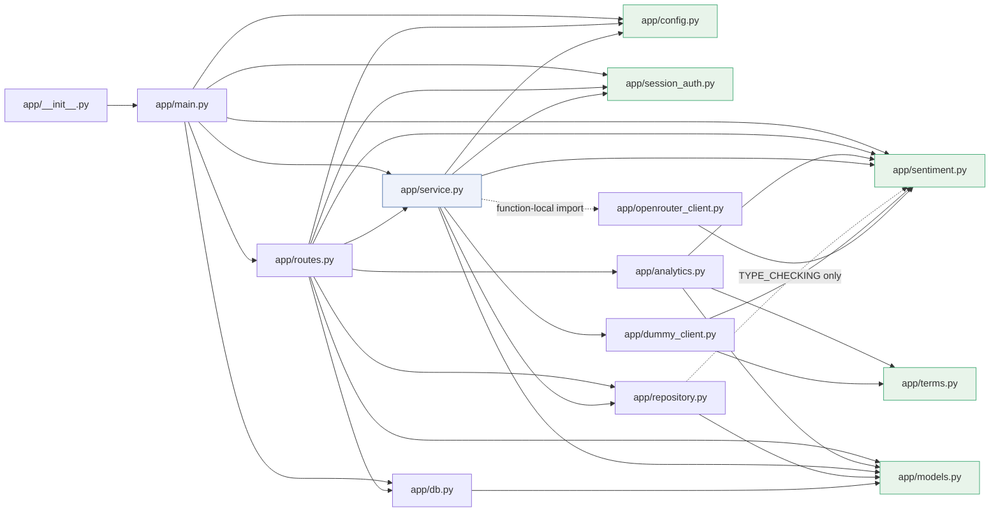

# Dependencies — `very-cool-sentiment-analysis` (repo `sentiment-opencode`)

## External Dependencies

### Direct runtime (the entire runtime surface)

| Dependency | Constraint | Installed | Why it is here | Used by |
|---|---|---|---|---|
| `fastapi` | `>=0.110` | 0.142.2 | The HTTP surface: routing, DI, body validation, exception handlers, static files | `app/main.py`, `app/routes.py` |
| `uvicorn` | `>=0.27` | 0.54.0 | The ASGI server | runtime only — never imported by `app/` |

**This is a hard cap, not an observation.** `pyproject.toml:11` cites NFR3.1
beside the list, and `tests/test_config.py:141-160` asserts it. The consequence
that shapes the whole codebase: **no HTTP client library** (both outbound calls
use stdlib `urllib`), **no ORM** (raw `sqlite3`), **no validation library** (stdlib
dataclasses), and **no browser-automation or test-client library**.

### Direct development

| Dependency | Constraint | Installed | Used by |
|---|---|---|---|
| `pytest` | `>=8` | 9.1.1 | the whole test runner |
| `pytest-cov` | `>=5` | 7.1.0 | the coverage floor in `addopts` |
| `ruff` | `>=0.6` | 0.16.9 | lint **and** format |

### Build

| Dependency | Constraint | Role |
|---|---|---|
| `setuptools` | `>=68` | PEP 517 build backend |

### Transitive

12 packages, all resolved by FastAPI / uvicorn / pydantic. **None is imported by
application code** — each is reached only inside a library. Full table in
**technology-stack.md**.

### Absent by decision

| Absent | Consequence |
|---|---|
| `httpx` / `requests` | `fastapi.testclient` is unusable; the suite carries its own hand-rolled in-process ASGI caller (`tests/conftest.py`) |
| Any ORM | All SQL is hand-written and parameter-bound; `repository.py` owns it |
| `pydantic` (direct) | Application types are stdlib dataclasses (A1 in **architecture.md**) |
| Any browser automation | `app.js` is never executed by the suite (stated in `tests/test_page.py:1-6`) |
| Any type checker | Annotations are present and unenforced |
| Any analytics / data library | Aggregate work must be plain SQL over SQLite |

### Supply chain

Floors, not pins. No lockfile, no hash pinning, no constraints file, no audit
command, no update bot, no git remote. The versions in **technology-stack.md**
describe this environment, not a reproducible resolution.

---

## Internal Cross-Package Dependencies

There is **one** importable package (`app`) plus one test package (`tests`), with
**no sub-packages and no vendored third-party code inside `app/`**. At the
*packaging* level `app` depends on nothing else local; internal coupling is by
import only.

### Module adjacency (static imports)

Read this as "`X` imports `Y`". The graph is **acyclic and descending**.

| Module (importer) | Imports | Fan-out |
|---|---|---|
| `app/__init__.py` | `app.main` | 1 |
| `app/main.py` | `app.db`, `app.config`, `app.routes`, `app.sentiment`, `app.service`, `app.session_auth` | 6 |
| `app/routes.py` | `app.db` (for `connect` only), `app.config`, `app.models`, `app.repository`, `app.analytics`, `app.sentiment`, `app.service`, `app.session_auth` | 8 |
| `app/service.py` | `app.config`, `app.dummy_client`, `app.models`, `app.repository`, `app.sentiment`, `app.session_auth` | 6 |
| `app/analytics.py` | `app.models`, `app.sentiment`, `app.terms` | 3 |
| `app/repository.py` | `app.models`; `app.sentiment` **under `TYPE_CHECKING` only** (`app/repository.py`) | 1 (+0 at runtime) |
| `app/db.py` | `app.models` (for `UNKNOWN_PROVIDER` only) | 1 |
| `app/dummy_client.py` | `app.sentiment`, `app.terms` | 2 |
| `app/openrouter_client.py` | `app.sentiment` | 1 |
| `app/terms.py` | — | 0 |
| `app/config.py` | — | 0 |
| `app/sentiment.py` | — | 0 |
| `app/session_auth.py` | — | 0 |
| `app/models.py` | — | 0 |

**Dynamic edge (not in the static graph):** `app/service.py` → `app/openrouter_client.py`,
imported **inside** `_live_client` (`app/service.py:103`) so the offline path
never loads the module that performs real HTTP. This is the one edge the static
graph does not show, and it is deliberate.

### Reverse adjacency (fan-in) and leaves

| Module | Imported by | Fan-in | Layer |
|---|---|---|---|
| `app/sentiment.py` | `main`, `routes`, `service`, `analytics`, `repository`(`TYPE_CHECKING`) | 5 | leaf |
| `app/models.py` | `routes`, `service`, `repository`, `db`, `analytics` | 5 | leaf |
| `app/config.py` | `main`, `routes`, `service` | 3 | leaf |
| `app/session_auth.py` | `main`, `routes`, `service` | 3 | leaf |
| `app/terms.py` | `dummy_client`, `analytics` | 2 | leaf |
| `app/db.py` | `main`, `routes` | 2 | persistence |
| `app/repository.py` | `routes`, `service` | 2 | persistence |
| `app/main.py` | `__init__` | 1 | composition root |
| `app/dummy_client.py` | `service` | 1 | adapter |
| `app/openrouter_client.py` | `service` *(function-local)* | 1 | adapter |
| `app/analytics.py` | `routes` | 1 | read module |
| `app/routes.py` | `main` | 1 | HTTP edge |
| `app/__init__.py` | — | 0 | re-export |

### Dependency graph



### Layering order

```
  app/__init__.py
        │
  app/main.py                      ← composition root
        │
  app/routes.py                    ← HTTP edge
        │
        ├──► app/service.py  ──────────────►  app/session_auth.py
        │         │                                      │
        │         ├──► app/dummy_client.py ──► app/terms.py   (leaf)
        │         ├──► app/openrouter_client.py ─────────────┘  (both implement SentimentClient)
        │         ├──► app/sentiment.py                         (leaf: the engine contract)
        │         ├──► app/repository.py ──► app/models.py
        │         ├──► app/config.py                            (leaf)
        │         └──► app/models.py                            (leaf: the record contract)
        │
        ├──► app/repository.py        (row reads, straight from the route)
        └──► app/analytics.py ──► app/models.py, app/sentiment.py, app/terms.py

  app/db.py ──► app/models.py        (imports UNKNOWN_PROVIDER only)
```

### Dependency properties

| Property | Status | How it was established |
|---|---|---|
| **No circular imports** | Holds | The full internal import graph is a descending chain. `repository → sentiment` is the only edge that would close a loop, and it is confined to `TYPE_CHECKING` so it never executes |
| **Leaves depend on nothing internal** | Holds | `config`, `sentiment`, `session_auth`, `models`, `terms` — five of the fourteen |
| **The HTTP edge owns `sqlite3`** | Holds | Only `app/routes.py:114` calls `db.connect` outside `db.py` |
| **The persistence layer has no runtime engine dependency** | Holds | `repository` consumes any object exposing the `SentimentResult` attributes, under a `TYPE_CHECKING`-only import |
| **Nothing below `routes.py` imports `fastapi`** | Holds | No `fastapi` import outside `routes.py` and `main.py` |
| **Single construction site per adapter** | Holds | `get_client` is the only `SentimentClient(...)` construction; `create_app` is the only `SessionAuth()` construction |
| **No shared mutable state** | Holds | The only process-wide mutable state is `app.state.session_auth`, owned by the composition root and read through a dependency |

---

## Cross-Component Dependencies (by concern)

The same relationships expressed by responsibility rather than by import.

| Concern | Owner | Consumers | Coupling kind |
|---|---|---|---|
| **Sentiment engine** | Sentiment Engine Interface | Offline Dummy Engine, Live OpenRouter Engine (both *implement*); Analysis Orchestration, HTTP API Surface (both *import*) | Protocol — the cleanest seam in the system |
| **Record shape** | Record and Request Contracts | Persistence and Schema, Analysis Orchestration, HTTP API Surface, Analytics Read Layer, Configuration (indirectly) | Shared immutable value type |
| **Analytics read** | Analytics Read Layer | HTTP API Surface (calls `resolve_range`/`read_summary`/`read_terms`) | A read module beside `repository`; receives the request's connection |
| **Tokenisation** | Term Extraction | Offline Dummy Engine, Analytics Read Layer | Pure leaf function on a token sequence |
| **Settings** | Configuration and Settings | Application Assembly, HTTP API Surface, Analysis Orchestration, Session Authorization | Shared immutable value type |
| **Session credential** | Session Authorization | HTTP API Surface, Analysis Orchestration | Injected object |
| **SQLite** | Persistence and Schema | HTTP API Surface (owns the connection), Application Assembly (runs `init_db`) | Driver — a stdlib singleton, not a service |
| **Error envelope** | HTTP API Surface | nothing | Internal to the edge |
| **Static markup** | Web UI | HTTP API Surface (serves it) | File read per request |
| **OpenRouter HTTPS** | Live OpenRouter Engine, Session Authorization | nothing upstream knows | **Two independent outbound call sites** |

### The one duplicated outbound concern

Both `app/openrouter_client.py` and `app/session_auth.py` build their own
`urllib.request` request rather than sharing one HTTP helper. This is **cohesion
chosen over DRY**: each module's stated single responsibility forbids importing
the other, and a shared helper would have to live in a third module that one of
them would then depend on. The measured cost is that the two request-building
bodies are the two uncovered blocks in the codebase (TD-9 in
**code-quality-assessment.md**).

### The one accidental dependency — now resolved

The tokeniser used to be an accident: `_WORD = re.compile(r"[a-z']+")` lived
underscore-private inside `app/dummy_client.py`. It is now the leaf
`app/terms.py` (`tokenize`), consumed by both `app.dummy_client` and
`app.analytics` (A4), so a second consumer no longer has to reach into an
unrelated module's private name. TD-6 in **code-quality-assessment.md** is
closed. The remaining deliberate duplication is the two `urllib` request bodies
above, which is where the accident's fingerprint still shows.

---

## Dependency Health

| Signal | Assessment |
|---|---|
| Direct runtime surface | **Two packages.** Exceptionally small, and enforced by a test |
| Transitive surface | 12 packages, none imported by application code |
| Acyclicity | Clean. No exceptions |
| Cycles as a risk | None. The layering is stable at this size |
| Fan-in concentration | `sentiment` and `models` at 5 importers each, `terms` at 2. All are deliberately small and heavily depended upon — the right shape for contracts |
| Fan-out concentration | `routes.py` at 8 and `service.py` at 6. Both are assembly points by role, so this is expected rather than a smell |
| Coupling hotspots | `routes.py` size and the two `urllib` duplicates. Both noted above |
| Version pinning | **Floors only.** No lockfile, no hashes. The main supply-chain gap |
| Update ownership | Unassigned. No remote, no bot, no audit cadence |

Component-by-component responsibility and health ratings are in
**component-inventory.md**. Layering, the transaction flows and the extension
seams are in **architecture.md**. Versions and tool configuration are in
**technology-stack.md**. Endpoint reference is in **api-documentation.md**.
Measured coverage, lint status and the full debt register are in
**code-quality-assessment.md**.