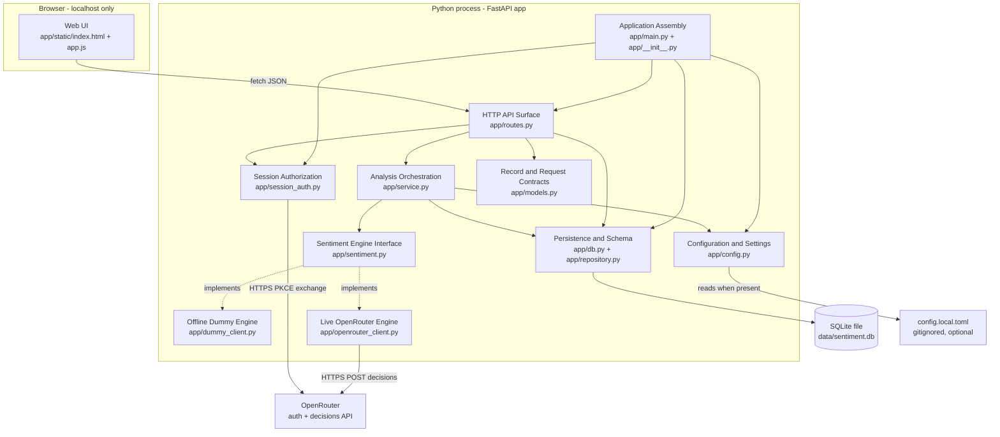
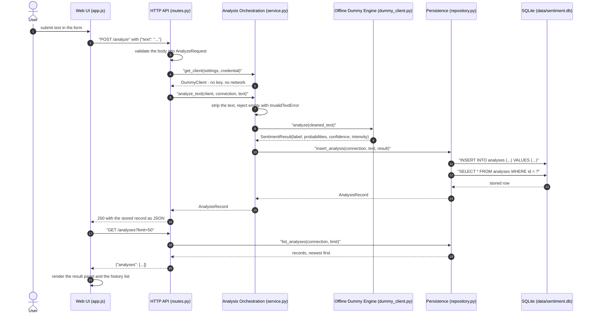
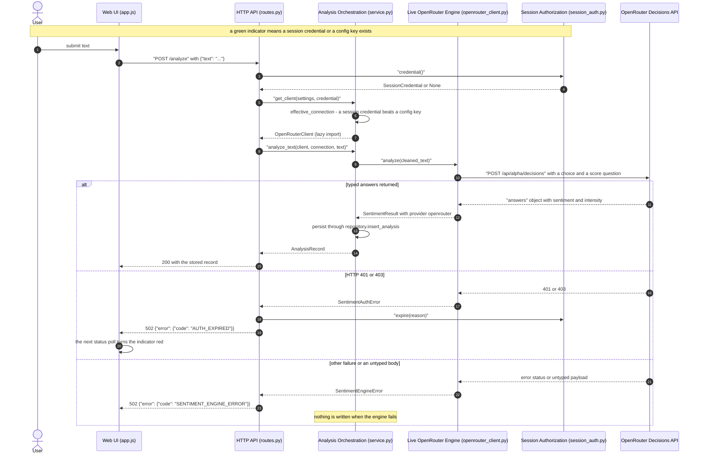
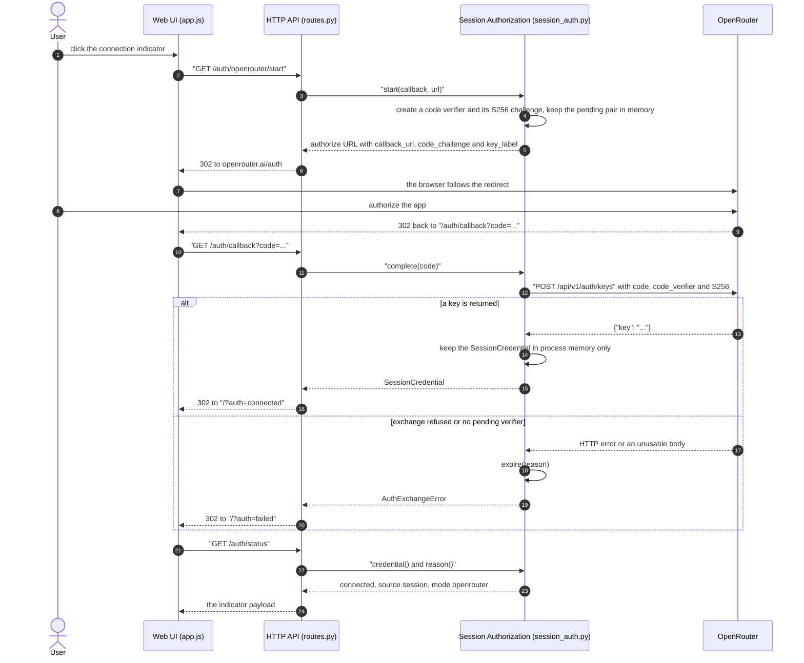
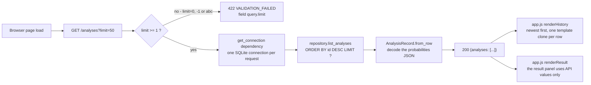

# Architecture — `very-cool-sentiment-analysis`

> Synthesised from the developer scan
> (`inception/reverse-engineering/developer-scan.md`) and verified against the
> scanned source. Repo-relative paths throughout.

## System Overview

One Python process serves one web page and a small JSON API from localhost. The
application lives entirely in `app/` (12 modules, ~1 500 lines) with a static
page in `app/static/`, a test suite in `tests/`, and a single SQLite file as its
only durable state (`data/sentiment.db`, gitignored).

The system has three external surfaces:

| Surface | Direction | Evidence |
|---|---|---|
| HTTP API on `127.0.0.1:8000` | inbound, browser only | `app/main.py:35-36`, `app/routes.py` |
| OpenRouter Decisions API (`/api/alpha/decisions`) | outbound, live mode only | `app/openrouter_client.py:30,122-189` |
| OpenRouter authorization (`/auth`, `/api/v1/auth/keys`) | outbound + browser redirect, in-app connect only | `app/session_auth.py:40-41,78-121,163-180` |

## Architectural Style

**Layered monolith (single deployable process) with a hexagonal seam at the
sentiment engine.** Evidence:

- *Single process / single deployment unit*: one `create_app()` factory; the
  routes, the service, the repository and the clients are imported into one ASGI
  application (`app/main.py:53-101`). No service boundaries, no message broker,
  no second entry point.
- *Layered data flow*: `routes` (presentation/transport) to `service`
  (orchestration) to `repository`/`db` (persistence), with `models` as the
  shared record shape (`app/routes.py`, `app/service.py`, `app/repository.py`,
  `app/models.py`).
- *Port-and-adapter seam*: `SentimentClient` is a `typing.Protocol` with a
  single `analyze(text) -> SentimentResult` method (`app/sentiment.py:56-61`),
  and exactly one module chooses a concrete implementation
  (`app/service.py:60-82`). `DummyClient` and `OpenRouterClient` are adapters
  behind that port; nothing above `service.py` knows which is active
  (`app/sentiment.py:1-8`).
- *Repository pattern (light)*: persistence is isolated behind
  `insert_analysis()` / `list_analyses()` and returns records read back from the
  database, not echoed payloads (`app/repository.py:38-80`).
- *No shared mutable state between modules*: the only mutable process state is
  the session credential store, which owns its own lock
  (`app/session_auth.py:141-160`).

Not present anywhere: microservices, serverless, events/queues, CQRS, a
template engine, an ORM, dependency injection framework, or a JS build step.

## Component Relationships



<!-- Text fallback: the browser page calls the HTTP API surface; the API surface depends on the analysis orchestration, the persistence module, the session authorization module and the record contracts; orchestration depends on the engine interface (implemented by the offline dummy engine and the live OpenRouter engine), on persistence and on configuration; the live engine and the session authorization module are the only components that talk to OpenRouter; persistence owns the SQLite file; configuration reads the optional gitignored TOML file. -->

**Text fallback (ASCII).** The dependency edges above, listed plainly:

```
Web UI ---------> HTTP API Surface
HTTP API Surface -> Analysis Orchestration, Persistence and Schema,
                    Session Authorization, Record and Request Contracts
Analysis Orchestration -> Sentiment Engine Interface, Persistence and Schema,
                          Configuration and Settings
Sentiment Engine Interface <- Offline Dummy Engine   (implements)
Sentiment Engine Interface <- Live OpenRouter Engine (implements)
Live OpenRouter Engine ---> OpenRouter (HTTPS)
Session Authorization -----> OpenRouter (HTTPS)
Persistence and Schema ----> SQLite file
Configuration and Settings -> config.local.toml (optional)
Application Assembly ------> HTTP API Surface, Configuration and Settings,
                             Persistence and Schema, Session Authorization
```

## Data Flow

1. **Startup.** `app/__init__.py:8` re-exports the module-level `app`, so
   `uvicorn app:app` resolves from the repo root. Building the app registers the
   lifespan (`app/main.py:65-77`), which resolves `Settings`, constructs the
   `SessionAuth` store, calls `db.init_db()` (idempotent `CREATE TABLE IF NOT
   EXISTS`) and logs the active mode exactly once — never the key.
2. **Request.** FastAPI resolves the request into an `AnalyzeRequest` dataclass
   (`app/models.py:34-41`), and the route pulls `Settings` from app state and one
   short-lived SQLite connection from the `get_connection` dependency
   (`app/routes.py:70-76`).
3. **Engine choice.** `service.effective_connection()` collapses the two
   credential sources into one answer — a session credential wins over a config
   key, anything else is the offline engine (`app/service.py:31-57`) — and
   `get_client()` is the only place that constructs a concrete engine, importing
   `openrouter_client` lazily so the offline path never loads it
   (`app/service.py:60-82`).
4. **Decision.** `service.analyze_text()` strips the text, rejects emptiness
   before the engine is called, calls `analyze()`, and persists
   (`app/service.py:85-104`).
5. **Persistence.** `repository.insert_analysis()` writes one row inside a
   transaction, then **reads it back** and maps it through
   `AnalysisRecord.from_row()`, so the API returns exactly what is stored
   (`app/repository.py:38-70`).
6. **Response.** `AnalysisRecord.to_dict()` renders the pinned field order
   (`app/models.py:64-77`); failures never reach the wire as a bare 500 — they
   are mapped onto the one error envelope (`app/routes.py:41-57,173-221`).

## Key Design Decisions (observed, with rationale and alternatives)

These are the decisions the code embodies. For each, the alternatives are the
ones the code demonstrably did *not* take.

| # | Decision | Rationale visible in code | Alternatives rejected |
|---|---|---|---|
| AD-1 | Define one `SentimentClient` Protocol and swap engines only in `service.get_client()` | Keeps the engine decision in one function so routes, repository and page never name a concrete engine (`app/service.py:60-82`, `app/sentiment.py:1-8`) | Import a concrete client in the route; branch on mode in each caller |
| AD-2 | Offline keyword engine is the default and the only engine the test suite touches | Guarantees the suite runs with no key and no network; a session-scoped autouse `offline_guard` makes accidental network use fail loudly (`app/config.py:93-123`, `tests/conftest.py:129-146`) | Require a key for every run; mock the network per test |
| AD-3 | Use the stdlib (`tomllib`, `sqlite3`, `urllib`) instead of an ORM, HTTP client, or config library | The dependency cap is an explicit requirement (NFR3): `fastapi` + `uvicorn` runtime, `pytest` dev (`pyproject.toml`) | SQLAlchemy + Alembic; `requests`/`httpx`; pydantic-settings |
| AD-4 | Plain dataclasses for the request body and the record, not pydantic models | Keeps `app/` free of a direct dependency on the validation library FastAPI happens to use; the wire and row shapes share one field list (`app/models.py:1-11,20-30`) | pydantic `BaseModel` request/response models |
| AD-5 | One error envelope with four machine codes for every non-2xx response | One shape for the page, the tests and any future client (`app/routes.py:41-57`, codes at `app/routes.py:32-37`) | Default FastAPI `{"detail": ...}`; per-handler ad-hoc bodies |
| AD-6 | Schema initialisation is an idempotent `CREATE TABLE IF NOT EXISTS` inside the lifespan | A fresh checkout needs no manual setup step (NFR6); `SCHEMA_VERSION` is written into `schema_meta` as a hook for later migrations (`app/db.py:14-83`) | Migration tool at first run; manual setup script |
| AD-7 | The API key is held only in `Settings` (config) or `SessionCredential` (memory), and every `__repr__` redacts it | Key leakage is a first-class risk, asserted by tests and stated in the committed example config (`app/config.py:27,47-52`, `app/session_auth.py:125-138`, `app/openrouter_client.py:93-95`, `config.example.toml`) | Persist the credential to disk for convenience |
| AD-8 | The live client reads only typed `choice`/`score` answers and raises instead of guessing | Never stores a fabricated label: a non-2xx, untyped or malformed response raises without writing a row (`app/openrouter_client.py:99-120,194-250`, `app/sentiment.py:36-54`) | Free-text parsing of the model reply; defaulting to `neutral` on failure |
| AD-9 | The in-app authorization keeps the credential in process memory only, under a lock, with a 600 s pending-verifier TTL | A restart returns to the offline engine; the store is safe from FastAPI's thread-pool workers (`app/session_auth.py:141-160,163-180,255-263`) | Write the key to `config.local.toml` or a server-side session store |
| AD-10 | One SQLite connection per request, opened and closed by a dependency | No connection pooling or shared handle to reason about (`app/routes.py:70-76`) | A module-level connection or a pool |

## Coupling Hotspots and Component Health

| Component | Fan-in | Fan-out | Health | Note |
|---|---|---|---|---|
| `sentiment.py` | 4 (`service`, both clients, `repository` under `TYPE_CHECKING`) | 0 | healthy | Small, stable contract; the seam the design depends on |
| `routes.py` | 1 (`main`) | 6 | at-risk | Widest fan-out and the only place that knows every layer; 221 lines holding page, API, auth routes and handlers (`app/routes.py`) |
| `service.py` | 2 | 6 | healthy | Central but thin; the single engine-selection point |
| `session_auth.py` | 3 (`main`, `routes`, `service`) | 0 internal | at-risk | 263 lines, the largest module; a whole OAuth-style flow inside a POC that the v1 intent does not ask for |
| `openrouter_client.py` | 1 (lazy, `service`) | 1 | degraded (unverified) | 250 lines never imported, constructed or called by any test (`README.md` "Notes", developer scan) |
| `models.py`, `config.py`, `db.py` | 3-4 | 0-1 | healthy | Leaf modules with no internal cycle |

The internal dependency direction is acyclic and one-way
(`app/main.py` to the rest; no module imports a module that imports it back).

## Improvement Opportunities

Ranked by architectural leverage, not effort:

1. **Decide the authorization flow's fate (D-1).** `app/session_auth.py`, the
   four `/auth/*` routes and 24 of 52 tests implement something the v1 intent
   does not ask for. Either the intent adopts it or the next stages remove it —
   leaving it undecided means every later stage re-litigates it.
2. **Give the record contract one source of truth.** `RECORD_FIELDS`
   (`app/models.py:20-30`), `ANALYSES_COLUMNS` (`app/db.py:38-48`),
   `to_dict()` (`app/models.py:64-77`) and the SQL DDL (`app/db.py:18-30`) are
   four hand-written copies of the same nine fields; only tests keep them
   aligned.
3. **Bring `routes.py` under a boundary.** Page serving, the analysis API, the
   auth endpoints and exception mapping share one file; splitting the auth
   surface out would shrink the widest module and match the component
   boundaries in the inventory.
4. **Measure the untested live client.** `app/openrouter_client.py` has no
   automated coverage at all, and there is no coverage tool or floor to detect a
   regression there.
5. **Close the connection-lifecycle question.** Per-request connections use
   default thread affinity (`app/db.py:51-63`, `app/routes.py:70-76`); the prior
   intent recorded the risk and accepted it, but it is unresolved in the code.
6. **Add the missing mechanical gates.** No linter, formatter or CI exists;
   `filterwarnings = ["error"]` is the only automated gate (see
   `code-quality-assessment.md`).

## Interaction Diagrams

The four diagrams below show how the system's business transactions are
implemented across components: scoring a text offline, scoring it live
(including the failure branches), connecting the app to OpenRouter, and reading
the history. Sources for every hop are the modules named in the diagram
participants.

### Transaction 1 — Submit a text with the offline engine



<!-- Text fallback: the page posts the text; the route validates the body, asks the service to build the client, and the service returns the offline dummy client; the service strips and rejects empty text, calls the dummy engine, and persists through the repository, which inserts a row and reads it back from SQLite; the stored record goes back to the page, which then fetches the newest 50 records for the history list. -->

**Text fallback (ASCII).**

```
User -> Page: submit text
Page -> API: POST /analyze {"text": "..."}
API -> Service: get_client(settings, credential)   -> DummyClient
API -> Service: analyze_text(client, connection, text)
Service -> Service: strip; reject empty (InvalidTextError)
Service -> Dummy: analyze(text)                    -> SentimentResult
Service -> Repository: insert_analysis(...)
Repository -> SQLite: INSERT ... then SELECT ... WHERE id = ?
Repository -> Service: AnalysisRecord
Service -> API: AnalysisRecord
API -> Page: 200 stored record JSON
Page -> API: GET /analyses?limit=50
API -> Repository: list_analyses(connection, 50)   -> newest first
API -> Page: {"analyses": [...]}
Page -> Page: render result panel + history list
```

### Transaction 2 — Submit a text with the live engine, and what happens when it fails



<!-- Text fallback: the page posts the text; the route reads the session credential, the service resolves the engine (a session credential wins over a config key) and builds the live client lazily; the client posts a choice question plus a score question to the OpenRouter Decisions API; a typed answer is persisted and returned with 200; HTTP 401 or 403 drops the credential, returns 502 AUTH_EXPIRED and the indicator turns red on the next poll; any other failure or an untyped body returns 502 SENTIMENT_ENGINE_ERROR, and no row is written in either failure branch. -->

**Text fallback (ASCII).**

```
Page -> API: POST /analyze
API -> SessionAuth: credential()
API -> Service: get_client(settings, credential)  -> OpenRouterClient (lazy import)
API -> Service: analyze_text(...)
Service -> Live: analyze(text)
Live -> OpenRouter: POST /api/alpha/decisions (choice + score questions)
  typed answers        -> SentimentResult -> persist -> 200 stored record
  401/403              -> SentimentAuthError -> expire(credential) -> 502 AUTH_EXPIRED
                          (indicator turns red on the next /auth/status poll)
  other/untyped failure -> SentimentEngineError -> 502 SENTIMENT_ENGINE_ERROR
  failure branches      -> no row is written
```

### Transaction 3 — Connect the app to OpenRouter from the page (PKCE, S256)



<!-- Text fallback: clicking the indicator sends the browser to /auth/openrouter/start, where the session store creates a PKCE verifier and S256 challenge, remembers the pair and returns OpenRouter's authorize URL; the browser authorizes and OpenRouter redirects back with a code; the route asks the store to complete the exchange, which posts the code and verifier to /api/v1/auth/keys, keeps the returned key in process memory, and redirects to the page with a connected marker; a refused exchange or a missing pending verifier expires the flow and redirects with a failed marker; the page then reads /auth/status and paints the indicator. -->

**Text fallback (ASCII).**

```
User -> Page: click the connection indicator
Page -> API: GET /auth/openrouter/start
API -> SessionAuth: start(callback_url)  (verifier + S256 challenge kept in memory)
API -> Page: 302 to openrouter.ai/auth?callback_url=...&code_challenge=...
User -> OpenRouter: authorize
OpenRouter -> Page: 302 /auth/callback?code=...
Page -> API: GET /auth/callback?code=...
API -> SessionAuth: complete(code)
SessionAuth -> OpenRouter: POST /api/v1/auth/keys {code, code_verifier, S256}
  key returned  -> SessionCredential in memory -> 302 /?auth=connected
  failure       -> expire(reason) -> 302 /?auth=failed
Page -> API: GET /auth/status  -> {connected, source, mode, model, reason}
```

### Transaction 4 — Read the stored history



<!-- Text fallback: loading the page or submitting a text triggers GET /analyses?limit=50; a limit below 1 or a non-numeric limit is rejected with 422 VALIDATION_FAILED on the query.limit field instead of being silently clamped; an accepted request opens one short-lived SQLite connection, reads the newest rows in descending id order, decodes each stored probabilities object and returns them as an analyses array, which the page renders newest-first into the history list. -->

**Text fallback (ASCII).**

```
Page load or after submit -> GET /analyses?limit=50
  limit < 1 or non-numeric -> 422 VALIDATION_FAILED (field query.limit), no clamp
  accepted                 -> one SQLite connection per request
                              -> list_analyses: ORDER BY id DESC LIMIT ?
                              -> from_row decodes the probabilities JSON object
                              -> 200 {"analyses": [...]}
                              -> app.js renders the history newest-first
```
