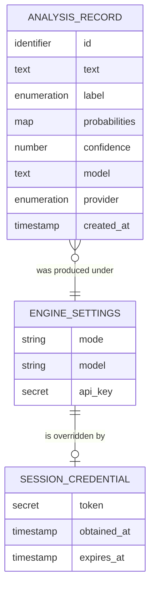

# Functional Specification — `u1-application`

The behavioural specification: the ordered workflows the unit runs and the state transitions its
entities pass through. `entities.md` owns the data shape and `rules.md` owns the decision logic; this
file owns behaviour over time. The ER diagram and rules summary at the end are derived views for
reading, not new sources of truth.

## Workflows

### W1 — Score a submitted text

1. Receive the submission with its text.
2. Validate: if the text is empty or whitespace only after trimming, refuse with the invalid-text
   code and store nothing (BR4.1).
3. Resolve the engine: a usable session credential means live (BR1.2); otherwise a configured live
   mode with a key means live (BR1.3); otherwise offline (BR1.1).
4. If live was requested and no key is usable, refuse with the instruction naming the config file
   (BR1.4) and store nothing.
5. Ask the engine: the offline engine returns its deterministic result; the live engine asks a choice
   question with exactly the three labels (BR2.1) and its answer is read as typed data — a selected
   label, a probability per label, and a confidence (BR2.2). If the answer cannot be read that way,
   the attempt fails (BR2.2) and nothing is stored.
6. Validate the result: every label carries a probability and the chosen label is one of the three
   (BR2.3); otherwise the attempt fails.
7. Persist one row carrying text, label, probabilities, confidence, model, provider and the
   timestamp (BR3.2). Any attribute the contract no longer produces is left unset (BR3.4).
8. Return the stored row as persisted, so the client sees what was actually saved.

**Failure paths.** Invalid text (step 2), the live-without-key refusal (step 4) and an unreadable
engine answer (steps 5–6) all leave the store untouched and answer through the single envelope
(BR4.3).

### W2 — Browse history

1. Receive the history request.
2. If a limit is supplied, validate it: below one or not a number is refused with the validation code
   and nothing is read (BR3.6).
3. Read rows newest-first, at most the limit when given, otherwise the documented default (BR3.5).
4. Return the rows.

### W3 — Report the active engine

1. Evidence the resolved mode and whether a usable credential exists.
2. Answer with the active engine and the connection state, carrying no credential material (BR4.4).

### W4 — Connect the live engine from the page

1. The user starts the sign-in flow; the app prepares the authorization request and redirects.
2. The provider redirects back with an outcome.
3. On success: hold the credential in memory for the session only (BR6.1); the next analysis resolves
   to live (BR1.2). The page reflects the connected state.
4. On failure: say what happened on the page and stay usable on the offline engine.
5. If a later provider call rejects the credential, discard it and resolve to offline (BR6.2); the
   page shows not-connected with a reason.

### W5 — Start the app

1. Resolve configuration; with nothing configured, resolve to offline (BR1.1) and use the default
   model (BR1.5).
2. Open the local store, creating it on first run (BR3.1).
3. Apply a schema change in place if the store predates the current contract, keeping every row
   (BR3.3).
4. Bind loopback only (BR5.2).
5. Log the active mode, never any credential material (BR5.1).

## State transitions

### AnalysisRecord

| From | Event | To | Notes |
|---|---|---|---|
| (none) | A submission passes validation, the engine answers and the write succeeds | Stored | The only creation path; a refused submission never creates a record |
| Stored | Read by the history workflow | Stored | Reads do not change a record |
| Stored | A schema change adds an attribute | Stored (extended) | The row survives; the new attribute is unset (BR3.3, BR3.4) |

A record is never updated or deleted in v1: history has no deletion path.

### SessionCredential

| From | Event | To | Notes |
|---|---|---|---|
| (none) | Sign-in completes | Held | Memory only (BR6.1) |
| Held | Provider rejects it later | Discarded | The app falls back to offline (BR6.2) |
| Held | Process exits | Gone | Nothing was written to disk |

### Engine mode

| From | Event | To | Notes |
|---|---|---|---|
| Offline | A usable credential appears (sign-in, or a configured key with live mode) | Live | BR1.2 then BR1.3 |
| Live | The credential is rejected | Offline | BR6.2 |
| Live | Process restarts with no session credential | Offline or Live | Re-resolved from configuration (BR1.1, BR1.3) |

## Derived view — entity relationships

Text fallback: `EngineSettings` is overridden by zero or one `SessionCredential`; each
`AnalysisRecord` was produced under one `EngineSettings` state. (The record does not store a foreign
key — the relationship is provenance, captured by `provider` and `model`.)

## Derived view — rules by workflow

| Workflow | Rules it applies |
|---|---|
| W1 Score a submitted text | BR4.1, BR1.1–BR1.4, BR2.1–BR2.3, BR3.2, BR3.4, BR4.3 |
| W2 Browse history | BR3.5, BR3.6 |
| W3 Report the active engine | BR4.4, BR1.6, BR5.1 |
| W4 Connect from the page | BR6.1, BR6.2, BR1.2, BR5.1 |
| W5 Start the app | BR1.1, BR1.5, BR3.1, BR3.3, BR5.2 |

## Edge cases carried from the stories

- **A very long text**: accepted as given; no length bound is specified in v1, and the live path's
  provider-side limit remains an open question in the contract.
- **A limit of exactly one**: valid (BR3.6 permits one and above).
- **An absent limit**: the documented default applies (BR3.5) — the number itself is an open contract
  question.
- **A second submission while the first is in flight**: allowed; each submission is independent and
  each stores its own row.
