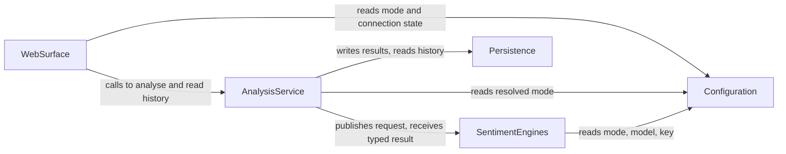

# Domain Design — Components

Five logical building blocks (answer Q1 = B), on today's module layout kept in place (Q5 = A). Every
entity has exactly one owner. Nothing here decides deployment topology, technology or NFR patterns.

## Part A — Machine-readable catalogue

```yaml
components:
  - name: Configuration
    summary: Resolves the active engine mode, model and credential source from the local config file.
    behaviour: >
      Reads the gitignored config.local.toml on startup; defaults to the offline engine when no file or
      key is present; treats a configured live mode with no usable key as a warning at startup and a
      refusal only when a live analysis is attempted; never renders, logs or stores the key, and every
      value that can hold it renders <redacted>.
    responsibilities:
      - Mode, model and credential resolution
      - Redaction of credential-bearing values
      - Reporting the active mode to the rest of the system
    depends_on: []
    dependents:
      - component: SentimentEngines
        interaction: Reads the active mode and model, and the key when live is usable
      - component: AnalysisService
        interaction: Reads the resolved mode for its dispatch decision
      - component: WebSurface
        interaction: Reads mode and connection state for the page and health endpoint
    external_dependencies:
      - name: config.local.toml
        kind: other
        purpose: The local, gitignored configuration file holding mode, model and key
    entities:
      - name: EngineSettings
        identifier: mode
        attributes: [mode, model, api_key]

  - name: Persistence
    summary: Owns the stored analysis record and the local SQLite file that holds it.
    behaviour: >
      Creates the database and schema on first run; migrates in place by adding a missing column while
      keeping existing rows; stores the chosen label, the per-label probabilities as JSON, the
      confidence, model and provider; reads history newest-first under a caller-set limit; never
      writes a value the v1 contract no longer produces.
    responsibilities:
      - Schema creation and in-place migration
      - Storing and reading analysis records
      - Owning the stored record's shape
    depends_on: []
    dependents:
      - component: AnalysisService
        interaction: Writes each analysis and reads history
      - component: WebSurface
        interaction: Serves the history view through the service
    external_dependencies:
      - name: SQLite (data/sentiment.db)
        kind: database
        purpose: The single local store for analyses
    entities:
      - name: AnalysisRecord
        identifier: id
        attributes: [id, text, label, probabilities, confidence, model, provider, created_at]

  - name: SentimentEngines
    summary: The engine contract and its two implementations — the offline stand-in and the live Jev client.
    behaviour: >
      Exposes one interface with exactly two implementations, named DummySentimentClient and
      OpenRouterJevSentimentClient; the live client asks a choice question over positive, negative and
      neutral and reads the selected label, the per-option probabilities and the confidence from the
      typed answer only, never parsing free text; the offline client is deterministic with no network
      and no key; either may fail, and a failure is never turned into a guessed label.
    responsibilities:
      - The engine interface and its two implementations
      - Building the live request and reading the typed answer
      - The deterministic offline result
    depends_on:
      - component: Configuration
        interaction: Reads mode, model and key before choosing an implementation
        style: sync
    dependents:
      - component: AnalysisService
        interaction: Dispatches an analysis request and receives the typed result
    external_dependencies:
      - name: OpenRouter Decisions API
        kind: third-party-api
        purpose: The live Jev model call, used only when live mode is usable
    entities: []

  - name: AnalysisService
    summary: Orchestrates one analysis — validates the text, dispatches to the engines, stores the result.
    behaviour: >
      Rejects empty or whitespace-only text before any engine work; dispatches through the in-process
      event handoff and receives the engine's typed result; persists exactly what it received; refuses
      a live attempt when live was requested and no key is usable, naming the config file; never writes
      a row for a refused request.
    responsibilities:
      - Request validation and refusal
      - Dispatching to the engines and consuming their results
      - Handing the result to persistence
    depends_on:
      - component: Configuration
        interaction: Reads the resolved mode for the dispatch decision
        style: sync
      - component: SentimentEngines
        interaction: Publishes an analysis request and receives the typed result
        style: event
      - component: Persistence
        interaction: Writes the result and reads history
        style: sync
    dependents:
      - component: WebSurface
        interaction: Calls the service from the API routes and the page
    external_dependencies: []
    entities: []

  - name: WebSurface
    summary: The HTTP surface, the page and the live-connection flow.
    behaviour: >
      Serves the single page, the JSON API and the health endpoint; validates request boundaries
      (empty text, a limit below one or non-numeric) with one error envelope; shows the label,
      confidence and per-label probabilities plus which engine answered; holds a credential obtained
      through the in-app sign-in in process memory only, drops a rejected credential and falls back to
      the offline engine; binds loopback only.
    responsibilities:
      - Routes, page, health endpoint and the error envelope
      - The in-app sign-in flow and the session credential
      - Presenting the result, the history and the active engine
    depends_on:
      - component: AnalysisService
        interaction: Calls it to analyse and to read history
        style: sync
      - component: Configuration
        interaction: Reads mode and connection state for the page and health endpoint
        style: sync
    dependents: []
    external_dependencies:
      - name: OpenRouter authorization endpoints
        kind: third-party-api
        purpose: The PKCE sign-in flow the user may use to connect the live model
    entities:
      - name: SessionCredential
        identifier: token
        attributes: [token, obtained_at, expires_at]
```

## Part B — Human-readable view

### Component Diagram



Text fallback (same edges): WebSurface → AnalysisService, WebSurface → Configuration, AnalysisService
→ Configuration, AnalysisService → SentimentEngines (event), AnalysisService → Persistence,
SentimentEngines → Configuration. No cycles.

### Component Summary

| Component | Purpose | Depends On | Dependents | Entities Owned |
|---|---|---|---|---|
| Configuration | Resolve mode, model and credential source | — | SentimentEngines, AnalysisService, WebSurface | EngineSettings |
| Persistence | Own and store the analysis record | — | AnalysisService, WebSurface | AnalysisRecord |
| SentimentEngines | Engine contract plus the two implementations | Configuration | AnalysisService | — |
| AnalysisService | Orchestrate one analysis end to end | Configuration, SentimentEngines, Persistence | WebSurface | — |
| WebSurface | HTTP surface, page and connection flow | AnalysisService, Configuration | — | SessionCredential |

### Entity Ownership

| Entity | Owning Component | Identifier | Attributes | References |
|---|---|---|---|---|
| EngineSettings | Configuration | mode | mode, model, api_key | — |
| AnalysisRecord | Persistence | id | id, text, label, probabilities, confidence, model, provider, created_at | — |
| SessionCredential | WebSurface | token | token, obtained_at, expires_at | — |

Attribute names only, no types: the full schema belongs to Functional Design.

### External Dependencies

| Component | Dependency | Kind | Purpose |
|---|---|---|---|
| Configuration | config.local.toml | other | Local gitignored configuration |
| Persistence | SQLite (data/sentiment.db) | database | Single local store for analyses |
| SentimentEngines | OpenRouter Decisions API | third-party-api | The live Jev call |
| WebSurface | OpenRouter authorization endpoints | third-party-api | The PKCE sign-in flow |

### Rationale

| Component | Why it is a separate building block |
|---|---|
| Configuration | Distinct change rate and a distinct concern (where settings come from); every other component reads it, nothing writes it |
| Persistence | Owns the record's shape and the only durable state; the migration and the storage contract change together |
| SentimentEngines | The swappable part of the system: the two implementations differ entirely in behaviour while the contract stays fixed |
| AnalysisService | Owns the sequence and the rules that are neither HTTP nor storage: validate, dispatch, store, refuse |
| WebSurface | Everything a person or an HTTP client touches, including the page states and the credential lifecycle |

### Component-boundary options considered

The collapsing decision (Q1 = B) had two viable alternatives; the trade-off is recorded in
`decisions.md` ADR-001 with both rejected options.

### Deliberate cycles

None. The dependency graph is acyclic.
