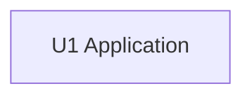

# Unit Dependencies — `very-cool-sentiment-analysis` v1

One unit, so the dependency graph is a single node with no edges. This artifact states the topology
only; the order in which work ships is Delivery Planning's economic decision.

## Dependency DAG



Text fallback: a single node, `U1 Application`, with no edges.

## Machine-readable edges

```yaml
units:
  - name: u1-application
    kind: service
    depends_on: []
```

One unit, one entry, an empty dependency list, no cycles (a single node cannot contain one).

## Rules this DAG satisfies

- Every unit appears exactly once, and every name in a `depends_on` list exists in the set.
- No unit depends on itself.
- No cycles.
- `depends_on` and its mirror are consistent by construction: with one unit there is no edge to
  mirror.

## Integration points between units

None. The unit is the whole deployable. The component edges recorded in
`domain-design/components.md` (WebSurface → AnalysisService → Persistence/SentimentEngines, and the
Configuration reads) are internal interfaces inside `U1`, including the in-process handoff that
ADR-003 introduces (answer Q5 = A).

## Parallel development opportunities

None. With a single unit there are no independent units and no multiple valid topological orderings;
the story work inside the unit is sequenced in `unit-of-work-story-map.md` for comprehension only,
not as a parallelisation plan.

## Walking skeleton

Not applicable to this run: the `classic` scope declares the skeleton flag off, there is no Unit DAG
to order, and the repository's application already runs end to end. No skeleton marker exists in any
artifact, so nothing here can contradict one.
