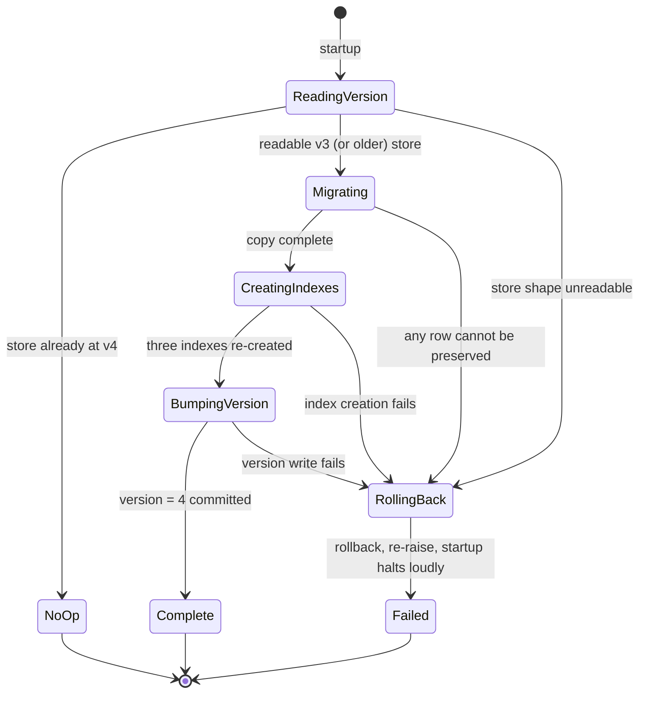
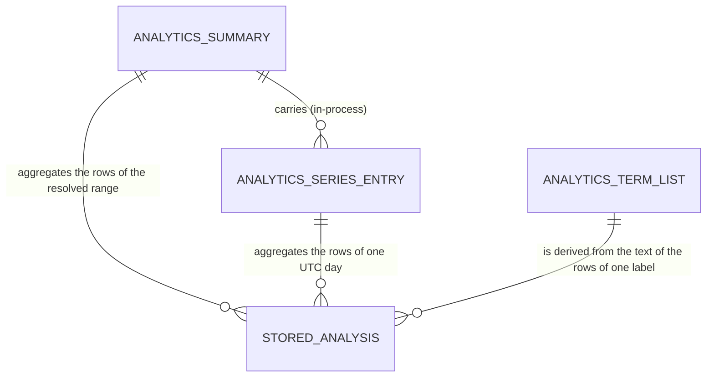

# Functional Specification — `u1-analytics-slice`
## Upstream inputs

This specification is derived from `unit-of-work.md` (the unit's definition and
kind) and `unit-of-work-story-map.md` (the stories and acceptance criteria this
unit owns), together with `requirements.md`, `components.md` and
`contract-summary.md`.

> **Intent:** `261001-analytics-layer` · stage `functional-design` (construction) ·
> unit `u1-analytics-slice` (kind `service`).
>
> **Source of truth.** This file is authoritative for the unit's **workflows** and
> its one **state machine**. `entities.md` is authoritative for the entity shape;
> `rules.md` is authoritative for the decision logic. The mermaid ER diagram and the
> rules summary below are **derived** views, included for readability.

## Scope this specification covers

`u1-analytics-slice` is the walking-skeleton unit. It delivers, end to end: the
additive v3 → v4 migration with its three named indexes and the index-survival fix;
the `/v2` router carrying the **summary** endpoint and the **terms** endpoint's
handler; the `AnalyticsRead` module computing every aggregate; the R-01 connection
fix; the concurrency harness; loopback enforcement; and the **summary region of the
view**. The detailed component specification of the full view — the shell, the range
control, the term-list containers, the loading/partial/error states and their
markup — belongs to **`u3-analytics-view`**, not here. This unit records only the
summary region's rendering rules (`BR2.11`, `BR2.12`, `BR2.13`, `BR2.14`) and cross-references `u3` for
the rest. Nothing is silently dropped.

---

## Workflow 1 — The summary request, end to end

1. A `GET /v2/analytics/summary` request arrives with the optional query
   parameters `from`, `to` and `import_id`. The page sends none of them on first
   load; `limit` is not a summary parameter and is ignored if sent.
2. The route validates the parameter syntax. A `from` or `to` that cannot be read
   as a UTC date is refused here, before anything is computed — `422`
   `VALIDATION_FAILED` whose message text names the parameter (`BR4.1`, `BR4.2`).
3. The route resolves the range (`BR1.1`–`BR1.3`). If `from` is later than `to`,
   the request is refused here with one `VALIDATION_FAILED` naming both bounds
   (`BR1.4`, `BR4.3`) and the series is never produced.
4. The route obtains the connection the HTTP layer owns and hands it to the read
   module; the read module never opens or closes a connection (`BR6.1`).
5. The read module computes the aggregates in-process:
   - a grouped read produces the range totals and the per-day buckets in one pass
     each, so the statement count does not grow with the number of days
     (`BR3.4`);
   - `total` and the per-label `counts` come from those rows (`BR2.1`);
   - if at least one row matched, `shares` are the per-label fractions rounded to
     four decimals (`BR2.2`) and `mean_confidence` is the four-decimal mean over
     all rows with `mean_confidence_row_count` equal to `total` (`BR2.3`).
6. The series is assembled (`BR3.1`): one entry per UTC calendar day in the
   **resolved range** — both bounds inclusive when supplied, the single-bound
   half-span of `BR1.2`, or, in the default unbounded case, the earliest stored
   analysis UTC day **through today inclusive** (`BR1.3`; Q12). Days with no rows
   inside a matched range are zero-filled, whether they sit between stored rows or
   at an **edge** of the resolved range (leading or trailing) — `total` 0, counts 0,
   shares `null`, mean `null`, row-count 0 (`BR3.2`). A trailing empty "today" is
   therefore emitted by the default first load; days between the last stored
   analysis and today are included and zero-filled. Each entry carries all six
   fields (`BR3.5`).
7. If **no** row matched (including an `import_id` that matches nothing), the
   answer is still a success: the summary's empty shape — `total` 0, counts 0,
   shares `null`, mean `null`, row-count 0, and an **empty** series — never a 404
   and never a store-wide zero-fill (`BR3.3`, `BR4.4`). The terms endpoint's empty
   body is its own frozen shape, `{positive: [], negative: []}` (`BR4.4`).
8. The six-field payload is serialised. `resolved_range` is an in-process value
   only and is **not** serialised.
9. A storage failure anywhere in the read is mapped to `500 STORAGE_FAILURE` —
   distinct from every validation code — and logged through the module logger
   with no credential and no interpolated statement text (`BR4.5`, `BR4.6`).

**The summary region of the view.** The page's summary region (containers for the
series and the label breakdown, one fetch per section) renders only returned
values; a `null` share becomes an explicit no-share marker, never a fabricated
`0%`; the view's `/v2` prefix constant is statically asserted against the
router's (`BR2.11`, `BR2.12`, `BR2.13`, `BR2.14`). The detailed component specification is
`u3-analytics-view`'s to carry.

## Workflow 2 — The terms request, end to end

1. `GET /v2/analytics/terms` arrives with the optional `from`, `to`, `import_id`
   and `limit`.
2. Parameter validation and range resolution are the **same** as Workflow 1
   (`BR1.5`), including the inverted-range refusal. A `limit` below 1 or
   non-numeric is refused `422` naming `query.limit` (`BR2.6`, `BR4.2`).
3. Rows are resolved identically to the summary, so both endpoints always
   describe one population (`BR1.5`).
4. The read module extracts terms from the text of the rows in range. Only rows
   labelled `positive` and `negative` contribute; `neutral` rows contribute to
   neither list (`BR2.4`).
5. Terms are ranked by count descending with ties broken alphabetically, and each
   entry carries only `term` and `count` (`BR2.5`).
6. Each list is materialised to at most `limit` entries (default 10). An oversized
   `limit` returns every available term rather than a clamp; a label with no rows
   yields an empty array, never `null` and never a padded top-N (`BR2.4`,
   `BR2.6`).
7. The payload is exactly two lists, `positive` and `negative`; there is no
   `neutral` list. A no-match range returns the terms endpoint's own empty body,
   `{positive: [], negative: []}` — no `total`, no `series` and no summary fields
   (`BR4.4`). A storage failure is the same `500 STORAGE_FAILURE` as Workflow 1.

## Workflow 3 — The startup migration

1. Application startup runs schema initialisation. It reads the stored schema
   version.
2. **Already at v4** → the step is a no-op; nothing changes and nothing is lost
   (`BR5.2`).
3. **At v3 (or an older readable version)** → the additive step runs inside one
   transaction: no column is dropped, renamed or retyped and no row is discarded
   or rewritten (`BR5.1`).
4. The three named indexes are ensured: `idx_analyses_created_at` on the
   created-at column, `idx_analyses_import_id` on the import-id column, and
   `idx_analyses_label_created_at` on the label-plus-created-at pair
   (`BR5.3`).
5. If the table-rebuild path is taken (rename → create → copy → drop), the three
   indexes are **re-created explicitly as steps after the copy**, because a
   create-table declaration cannot declare an index (`BR5.4`).
6. The stored schema version is bumped to 4 **in the same transaction** as the
   step (`BR5.5`).
7. The index-creating step is placed after the migrate-or-create branch, so it
   runs on both the migrate path and the fresh-create path (`BR5.6`).
8. If any part cannot preserve every row — including an unreadable store shape —
   the transaction **rolls back and re-raises**, so startup halts loudly rather
   than serving on a half-migrated store (`BR5.5`).

### State machine — the migration

This is the one place in the unit where a genuine lifecycle exists: a store moves
between schema versions, and the transaction either commits whole or rolls back.
The request workflows above are **workflows, not lifecycles**, and are deliberately
not drawn as state machines.



**Text fallback.** `startup → ReadingVersion`. From `ReadingVersion`: a store at
v4 → `NoOp` → end; a readable store below v4 → `Migrating`; an unreadable shape →
`RollingBack`. `Migrating → CreatingIndexes` (copy complete) → `BumpingVersion`
(three indexes re-created) → `Complete` (version 4 committed) → end. Any failure on
the migrate, index or version step → `RollingBack` → `Failed` (rollback, re-raise,
startup halts loudly) → end. The only successful terminal states are `NoOp` and
`Complete`; `Failed` is a loud terminal state, never a silent partial commit.

## Workflow 4 — The range-change refetch and the superseded response

This workflow describes the summary region's fetch discipline; the full view's
state model is `u3-analytics-view`'s.

1. The view issues **both** analytics fetches for a range change with the **same**
   bounds, so the series, the breakdown and the term lists describe one population
   (`BR1.5`, `BR2.11`).
2. If the caller changes the range again while the first pair is still in flight,
   the newest range becomes current.
3. When responses settle, only the **newest range's** responses are rendered; a
   late response from a superseded range is **discarded** rather than allowed to
   overwrite current data. (The discard rule is owned by `u3-analytics-view` and
   pinned by contract C2; it is recorded here because the summary region's fetch
   participates in it.)
4. A failed section renders an in-place failure rather than an empty success; a
   section that succeeds while another fails shows the successful section plus a
   partial-failure marker, so the two never silently disagree about the range.

---

## Derived view — entity-relationship diagram

Derived from the ```yaml` block in `entities.md`; that block is the source of
truth. Only `StoredAnalysis` is persisted; the other three shapes are computed on
request and never stored. The cardinality direction is stated on each edge: a
computed shape is the "one" side and the stored rows it aggregates or is derived
from are the "many" side.



**Text fallback (adjacency form).** `AnalyticsSummary (computed) -> [StoredAnalysis
rows in the resolved range]`: one summary aggregates zero or more stored analyses.
`AnalyticsSeriesEntry (computed) -> [StoredAnalysis rows of one UTC day]`: one entry
aggregates zero or more stored rows (zero when the day was zero-filled).
`AnalyticsTermList (computed) -> [StoredAnalysis rows carrying its label]`: one list
is derived from zero or more stored rows. `AnalyticsSummary -> [AnalyticsSeriesEntry]`:
one summary carries zero or more series entries. `StoredAnalysis (persisted, owned by
Persistence and Schema)` is the "many" side of all three aggregations. All three
computed shapes are derived from `StoredAnalysis` and store nothing; neither the
summary, nor a series entry, nor a term list has a table, a migration or an index.
The migration's three indexes are schema artifacts owned by `Persistence and
Schema`, not entities.

## Derived view — rules summary

Derived from `rules.md`; that file is the source of truth. The full statements,
triggers, IF/THEN logic and violation behaviours live there.

| Group | Theme | Rules |
|---|---|---|
| `BR1` | Range resolution | `BR1.1`–`BR1.5` — inclusive UTC days; single bound never dropped; unbounded span; inverted-range refusal; shared resolution. |
| `BR2` | Aggregation, computation, summary-region rendering | `BR2.1`–`BR2.15` — totals/counts, shares, mean + row count, term membership/ranking/limit, read-only, no egress, parameter binding, module placement, and the summary region's four rendering rules. |
| `BR3` | The per-day series and proportional work | `BR3.1`–`BR3.6` — one entry per day inside a matched range; zero-filled internal gap; empty series on no match; one grouped read; all six fields; the 200 ms budget. |
| `BR4` | Refusal, failure, observability | `BR4.1`–`BR4.7` — the frozen `{code, message}` envelope; malformed-parameter refusal; inverted-range refusal; no-match is success; `500 STORAGE_FAILURE`; logging; `/v1` compatibility. |
| `BR5` | The additive migration | `BR5.1`–`BR5.6` — additive only; idempotent; three named indexes; explicit re-creation after the rebuild; same-transaction version bump and loud rollback; placement after the branch. |
| `BR6` | Connection, concurrency, process exposure | `BR6.1`–`BR6.6` — connection is received not owned; explicit thread affinity stated in the owning module's documentation; concurrent reads raise no cross-thread error; the replaced harness; loopback enforcement; real-value tests. |

## Cross-reference — the view's detailed component specification

This unit's kind is `service`, so `frontend-components.md` is not in its artifact
matrix and is deliberately not produced. The unit nonetheless owns the **summary
region of the view** (the `US6.2` slice half: the series and label-breakdown
region). Its rendering rules are recorded as `BR2.11`, `BR2.12`, `BR2.13` and `BR2.14` above so they are
not dropped, and the **detailed component specification — component hierarchy,
props/state, interaction flows, form/range validation and the loading, empty,
partial-failure and error states — is carried by `u3-analytics-view`.** The two
records are complementary: this unit owns the summary region's rules and the
endpoint contract (C1/C2), and `u3` owns the view's component specification and
the two term-list containers.

## Open points and contradictions carried to the gate

- **`AC2.4.3` is unreachable as written.** `import_id` is opaque with no parse
  step, so the required 422 naming `query.import_id` has no trigger. The criterion
  is recorded **`N/A`** in `traceability.json`; the unreachable `import_id` clause
  identifies no BR target, and the reachable `from`/`to` halves map to `BR4.2`. No
  test is written for an impossible input. (Contract UC1.)
- **`AC2.3.3`'s second clause conflicts with itself.** `BR3.2` pins the correct
  reading: on a day with no rows `mean_confidence` is `null` and
  `mean_confidence_row_count` is `0` (the day's total). (Contract UC2.)
- **`AC2.4.5` is a duplicated id** in `stories.md` — one clause for the terms
  `limit`, one for the storage failure. The traceability entry covers both.
- **Rounding tie rule is ruled half-up (contract O1; R-06).** Four-decimal
  rounding is pinned by `BR2.2`/`BR2.3`, but the half-up vs half-even tie rule is
  **not settled here** — the human is choosing it now. Each rule in `rules.md`
  carries a labelled `[AWAITING HUMAN RULING — R-06]` placeholder for a follow-up
  edit to fill; this stage and the human ruled half-up at this gate and no pinned test may exercise a
  tie until it is decided.
- **`resolved_range` is not on the wire** (contract UC3): it is the in-process
  identifier of `AnalyticsSummary`, and the serialised payload is the six fields.
