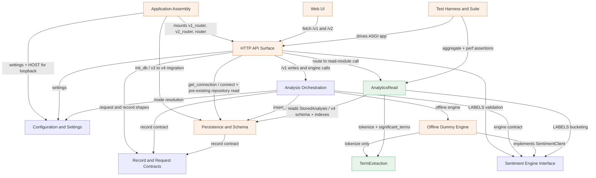

# Domain Design — Component Catalogue — sentiment-opencode v2 analytics layer

> **Intent:** `261001-analytics-layer` · stage `domain-design` (inception) ·
> brownfield extension of a twelve-component local app.
>
> This stage identifies the **logical building blocks** the analytics layer adds —
> code the team writes. It does **not** decide deployment topology (Units
> Generation does), the technology stack, or NFR patterns (later stages do).
> Databases, caches and third-party services are `external_dependencies`, never
> components.
>
> **Entity capture depth — read this before treating the catalogue as a schema.**
> Entities are captured at the **ownership + shape** level only: which component
> owns each entity, its identifier, its attribute names, and any cross-component
> references. **No data types, no validation constraints, no allowed values and no
> relationship cardinality are stated here** — that full schema belongs to
> Functional Design (`entities.md`). This document must not be read as a schema.
>
> **Scope of the catalogue.** It lists the components this feature adds or changes
> and the existing components it touches. Dependency lists are **feature-scoped**:
> they record the edges this feature reasons about and must not break. The complete
> pre-existing adjacency table is `aidlc/spaces/default/codekb/sentiment-opencode/dependencies.md`,
> which remains authoritative for unchanged edges.
>
> **Row count — ten existing plus two new, twelve rows in all.** The catalogue
> lists **10 existing components** it adds to or touches, plus **2 new
> components** (`AnalyticsRead`, `TermExtraction`) — twelve component rows. The
> repository has twelve pre-existing components; the two the feature does not
> touch — **`Live OpenRouter Engine`** and **`Session Authorization`** — are
> **deliberately omitted** under this catalogue's feature scope, because the
> analytics layer neither changes them nor reasons about an edge to them. The
> omission is scope, not oversight: their rows appear in
> `component-inventory.md`, which remains authoritative for the whole repository.
>
> **Upstream inputs.** `inception/requirements-analysis/requirements.md` (including
> its **Revision 2** corrections), `inception/user-stories/stories.md`,
> `inception/refined-mockups/mockups.md`, the eight human boundary rulings in
> `domain-design-questions.md`, `memory/team.md`, and the CodeKB
> (`component-inventory.md`, `architecture.md`, `dependencies.md`).
>
> **Component names** reproduce `component-inventory.md` exactly, so the two
> artifacts agree.

## Part A — Machine-readable catalogue

```yaml
components:
  - name: Application Assembly
    summary: >
      Build the application and own startup; mount the new v2 router and enforce
      the loopback bind.
    behaviour: >
      Changed in three feature-relevant ways while keeping its composition-root
      role. It mounts a third data router (v2_router) alongside v1_router and the
      unprefixed router, so the two analytics endpoints are reachable (FR2.1,
      FR3.1). It still runs db.init_db at startup, which now performs the additive
      v3 -> v4 migration and the three index creations (FR5.x). It must enforce
      the loopback bind at startup so a non-loopback host fails loudly rather
      than being silently ignored by uvicorn's own default (FR7.6). No analytics
      logic, no SQL and no view code is added here.
    responsibilities:
      - Own create_app, the lifespan, the router mounting and the exception handlers
      - Enforce the loopback HOST constant in the run path (FR7.6)
    depends_on:
      - component: Configuration and Settings
        interaction: resolves Settings at startup, and reads HOST for loopback enforcement
        style: sync
      - component: Persistence and Schema
        interaction: calls init_db, which now migrates v3 -> v4 and creates the three indexes
        style: sync
      - component: HTTP API Surface
        interaction: mounts v1_router, the new v2_router and the unprefixed router
        style: sync
    dependents: []
    external_dependencies:
      - name: FastAPI
        kind: other
        purpose: the ASGI application framework the composition root composes
      - name: uvicorn
        kind: other
        purpose: the ASGI server the documented run path uses
    entities: []

  - name: Configuration and Settings
    summary: >
      Decide which engine the app runs and where its database lives; unchanged by
      this feature and gains no new analytics configuration value.
    behaviour: >
      Unchanged in shape. The analytics layer introduces no new configuration
      value (US8.6.4) — all analytics behaviour is either computed or a request
      parameter. This component remains a fan-out-0 leaf whose only feature
      interaction is Application Assembly reading HOST for loopback enforcement.
    responsibilities:
      - Own Settings resolution, the redacted key, and the config.local.toml / config.example.toml convention
    depends_on: []
    dependents:
      - component: Application Assembly
        interaction: settings at startup and the HOST value
      - component: HTTP API Surface
        interaction: settings supplied through dependency providers
      - component: Analysis Orchestration
        interaction: engine selection and effective_connection read the resolved mode
    entities: []

  - name: Record and Request Contracts
    summary: >
      Define the wire and storage shape of one analysis in one place; unchanged by
      this feature.
    behaviour: >
      Unchanged. It keeps ownership of the AnalysisRecord and AnalyzeRequest
      contract value objects, which the analytics layer reads but does not
      reshape. The two analytics response shapes are NOT added here: they are
      computed value shapes owned by AnalyticsRead (ADR-005), which avoids
      deepening the existing four-copy contract problem (TD-8) with a fifth
      hand-maintained copy. No analytics field is added to these contracts.
    responsibilities:
      - Own the AnalysisRecord and AnalyzeRequest contract value objects
      - Own undeclared_body_fields and the record/request field sets
    depends_on: []
    dependents:
      - component: HTTP API Surface
        interaction: request and record shapes for the /v1 surface
      - component: Analysis Orchestration
        interaction: builds and validates records
      - component: Persistence and Schema
        interaction: maps rows to and from the record contract
    entities: []

  - name: Sentiment Engine Interface
    summary: >
      Define what a sentiment engine is; unchanged, but gains AnalyticsRead as a
      new dependent for the closed label vocabulary.
    behaviour: >
      Unchanged. It keeps ownership of LABELS (the canonical closed label set) and
      the SentimentResult / SentimentClient contract. AnalyticsRead imports LABELS
      so the summary and series bucket counts over the same closed vocabulary the
      engine validates against (ADR-008). No member is added to the interface, and
      both adapters' behaviour is untouched (US8.5.3).
    responsibilities:
      - Own LABELS, SentimentResult and the SentimentClient protocol
      - Own validate_result and the engine error types
    depends_on: []
    dependents:
      - component: HTTP API Surface
        interaction: imports the interface and the label vocabulary
      - component: Analysis Orchestration
        interaction: validates engine results against the interface
      - component: Offline Dummy Engine
        interaction: implements SentimentClient
      - component: AnalyticsRead
        interaction: imports LABELS for closed-label bucketing of aggregates
    entities: []

  - name: Offline Dummy Engine
    summary: >
      Produce a deterministic offline sentiment decision; the promoted tokenizer
      replaces its private regex with no scoring change.
    behaviour: >
      Changed in exactly one respect. Its private tokenizer (_WORD, the only
      tokenizer in the repository) is removed, and it calls the promoted
      TermExtraction tokenize operation instead (FR4.5, US4.2). Its scoring
      behaviour is otherwise IDENTICAL: the 3-character minimum and the stopword
      list apply to analytics term extraction and NOT to sentiment scoring
      (FR4.5, A4). It does not import the analytics filter operation.
    responsibilities:
      - Own deterministic keyword classification and the fixed probability triples
      - Call TermExtraction.tokenize; own no tokenizer regex of its own
    depends_on:
      - component: Sentiment Engine Interface
        interaction: implements the SentimentClient protocol contract
        style: sync
      - component: TermExtraction
        interaction: tokenizes text for keyword counting (tokenize only, never the filter)
        style: sync
    dependents:
      - component: Analysis Orchestration
        interaction: the default offline engine selected by get_client
    external_dependencies: []
    entities: []

  - name: Analysis Orchestration
    summary: >
      Turn submitted text into a persisted analysis; unchanged, and holds no read
      function.
    behaviour: >
      Unchanged, and deliberately so. It keeps writes and engine calls, and it
      keeps holding NO read or query function — the analytics read path never
      enters it (ADR-008, FR1.1). The new analytics endpoints call AnalyticsRead
      directly from the route, so this component's shape is untouched. This entry
      is present to record that the read path's absence from the service layer is
      an arrangement, not an accident.
    responsibilities:
      - Own analyze_text, import_texts, get_client and effective_connection
      - Keep all write paths and engine selection; own no read or aggregate function
    depends_on:
      - component: Persistence and Schema
        interaction: inserts analyses through insert_analysis
        style: sync
      - component: Sentiment Engine Interface
        interaction: validates typed engine results
        style: sync
      - component: Configuration and Settings
        interaction: reads the resolved mode for engine selection
        style: sync
      - component: Offline Dummy Engine
        interaction: constructs the offline engine when offline or unconfigured
        style: sync
      - component: Record and Request Contracts
        interaction: builds and returns AnalysisRecord and ImportSummary
        style: sync
    dependents:
      - component: HTTP API Surface
        interaction: /v1 write and engine routes call the orchestration hub
    external_dependencies: []
    entities: []

  - name: Persistence and Schema
    summary: >
      Own the local database file's shape and lifecycle; keeps ownership of the
      v3 -> v4 migration and the three indexes, and fixes TD-1 inside this
      component.
    behaviour: >
      Changed inside the existing component — no new owner. SCHEMA_VERSION moves
      to 4 with an additive, idempotent v3 -> v4 step that drops, renames and
      retypes nothing and preserves every row (FR5.1, FR5.4, FR5.6). The three
      indexes are created exactly by name: idx_analyses_created_at on created_at,
      idx_analyses_import_id on import_id, idx_analyses_label_created_at on
      (label, created_at) (FR5.2). The TD-1 defect is fixed here: _rebuild_analyses
      re-creates the three indexes explicitly as statements after the RENAME ->
      CREATE TABLE -> COPY -> DROP TABLE copy, so a migrating store no longer
      silently loses every index (FR5.3, Revision 2 correction: SQLite's CREATE
      TABLE has no index declaration). The version bump lands in the same
      transaction as the migration (FR5.7). No analytics query is added here —
      aggregate reads live in AnalyticsRead.
    responsibilities:
      - Own db.connect, db.init_db, SCHEMA_VERSION, all DDL and the in-place migration
      - Own the three indexes as schema artifacts (not domain entities)
      - Own all DML in repository.py
    depends_on:
      - component: Record and Request Contracts
        interaction: maps rows to and from the record contract
        style: sync
    dependents:
      - component: Application Assembly
        interaction: runs init_db at startup
      - component: HTTP API Surface
        interaction: get_connection is the sole connection creation and close site; plus the pre-existing direct routes -> repository read calls (list_analyses, list_analyses_by_import_id) that ADR-008 records
      - component: Analysis Orchestration
        interaction: inserts analyses through the repository
      - component: AnalyticsRead
        interaction: reads StoredAnalysis rows against the v4 schema and the three named indexes this component owns
    external_dependencies:
      - name: SQLite
        kind: database
        purpose: the single local data store file whose schema and indexes this component owns
    entities:
      - name: StoredAnalysis
        identifier: id
        attributes: [id, text, label, probabilities, confidence, intensity, model, provider, created_at, import_id]
      - name: SchemaVersion
        identifier: key
        attributes: [key, value]

  - name: HTTP API Surface
    summary: >
      Translate HTTP into service and read calls and failures into one envelope;
      gains a v2_router with two analytics handlers, owns the R-01 fix, and keeps
      the single error envelope.
    behaviour: >
      Changed inside the existing component — the file grows, no new HTTP
      component (ADR-003). It gains v2_router, a third APIRouter on the /v2
      prefix, carrying exactly two read handlers alongside the one V1_PREFIX
      (FR2.1, FR3.1). Both handlers call AnalyticsRead directly, never
      Analysis Orchestration (ADR-008). Validation failures travel through the
      single existing error_response envelope: 422 VALIDATION_FAILED whose message
      text names the offending parameter, and for an inverted range names both
      query.from and query.to (Revision 2; the envelope is exactly {code,
      message} with no field member). A storage failure answers 500 carrying one
      machine code distinct from every validation code — the only permitted
      envelope-set change (FR2.12, FR8.2). This component owns the R-01 fix
      because get_connection is the only place the sqlite3 driver and the
      connection lifecycle are touched anywhere in the codebase; the chosen
      thread-affinity and lifecycle decision is stated explicitly in that module's
      docstring (ADR-006, FR1.6, US1.2). No SQL and no sentiment logic is added.
    responsibilities:
      - Own v1_router and the new v2_router, their handlers and the error envelope
      - Own get_connection and therefore the R-01 fix and the connection lifecycle
      - Reject malformed and inverted range parameters through the existing envelope
    depends_on:
      - component: AnalyticsRead
        interaction: the two /v2 handlers call the read module directly for summary and terms
        style: sync
      - component: Persistence and Schema
        interaction: get_connection opens and closes the sole connection via db.connect; plus the pre-existing direct read path in which routes.py imports and calls list_analyses and list_analyses_by_import_id from repository.py (ADR-008)
        style: sync
      - component: Analysis Orchestration
        interaction: the /v1 write and engine routes call the orchestration hub
        style: sync
      - component: Record and Request Contracts
        interaction: request and record shapes on the /v1 surface
        style: sync
      - component: Sentiment Engine Interface
        interaction: label validation and the closed vocabulary
        style: sync
      - component: Configuration and Settings
        interaction: settings supplied through dependency providers
        style: sync
    dependents:
      - component: Application Assembly
        interaction: mounts both routers into the application
      - component: Web UI
        interaction: the page fetches /v1 and the new /v2 endpoints over HTTP
      - component: Test Harness and Suite
        interaction: drives the ASGI application in-process and concurrently
    external_dependencies:
      - name: SQLite
        kind: database
        purpose: the connection the handlers own and hand to the read module
      - name: FastAPI
        kind: other
        purpose: routing, dependency injection and the exception handlers that build the envelope
    entities: []

  - name: Web UI
    summary: >
      The page and its one script; grows a third top-level analytics view inside
      the existing single-page shell.
    behaviour: >
      Changed inside the existing component — app.js stays inside Web UI and the
      component grows; there is no second script file and no new Web UI component
      (ADR-007). The shell gains a header and a nav with three view entries, and
      a third top-level analytics view is added to the existing markup and to the
      existing static-asset serving — not a second site (FR6.1). The view renders
      the per-day series, the label breakdown with counts and shares, and both
      term lists at the affirmed top 10 per list (FR6.2). It has a labelled date
      range control with an explicit unbounded default and an explicit
      'Show all time' reset; it has NO import_id control and NO limit control —
      those filters are API-only (FR6.3, US6.3). Changing the range refetches both
      endpoints with the same bounds so all three sections describe one population
      (FR6.4). Rendering is native HTML and the existing class names, using
      textContent everywhere and no chart library or new front-end dependency
      (FR6.6). A failed read renders an inline error state through the single
      app-wide error panel, with a distinct role=status loading region and a
      distinct partial-failure region, so loading, empty and error are never
      confused (FR6.7, FR6.8). The view's markup hooks are added to the existing
      pinned data-testid convention (FR6.9). The analytics path never renders the
      word 'intensity' anywhere in the served page.
    responsibilities:
      - Own index.html and app.js, now including the three-view shell and the analytics view
      - Own the two analytics fetches and the range/loading/empty/error/partial states
    depends_on:
      - component: HTTP API Surface
        interaction: fetches /v1 and the two new /v2 analytics endpoints over HTTP
        style: sync
    dependents: []
    external_dependencies: []
    entities: []

  - name: AnalyticsRead
    summary: >
      The new analytics read/aggregate module beside the repository: computes
      summary, per-day series and ranked term lists from stored rows.
    behaviour: >
      NEW component. It owns all aggregate read queries for the analytics layer
      and is called from the route, never through Analysis Orchestration (FR1.1).
      Every aggregate is computed in-process from stored rows, with no external
      service, no network call and no model inference (FR1.2). It receives the
      connection the HTTP layer owns and never opens, closes or owns one itself
      (FR1.3). Every statement is parameter-bound with no SQL interpolation
      (FR1.4, US8.3). It declares a Single responsibility: line in its module
      docstring, matching the eleven existing modules (FR1.5). It performs no
      write and no access bookkeeping (FR2.13). The per-day series is produced by
      one grouped query over the resolved range and zero-filled in-process, so the
      SQL statement count is independent of the number of days in the range
      (NFR1, US8.1). It resolves the range identically for both endpoints — bounds
      inclusive, single bounds never dropped, an unmatched import_id behaving like
      an empty range, an inverted range refused — so summary and terms never
      disagree about which rows are in range (FR2.4-FR2.11, FR3.8, US3.2). It
      computes shares as fractions in [0,1] rounded to four decimals with a null
      on a zero denominator, and answer null rather than a fabricated number
      everywhere an aggregate has no inputs (FR2.7, FR2.8, A3). It exposes the two
      operations to route callers: compute the summary and compute the terms.
    responsibilities:
      - Own all aggregate SQL for the analytics layer, always parameter-bound
      - Own range resolution, zero-fill, share/mean computation and term ranking
      - Own no connection lifecycle, no write and no persisted entity
    depends_on:
      - component: TermExtraction
        interaction: extracts significant terms from the text of rows in range
        style: sync
      - component: Sentiment Engine Interface
        interaction: imports LABELS so counts and shares bucket over the closed label set
        style: sync
      - component: Persistence and Schema
        interaction: reads StoredAnalysis rows and relies on the v4 schema and the three named indexes (idx_analyses_created_at, idx_analyses_import_id, idx_analyses_label_created_at) owned there
        style: sync
    dependents:
      - component: HTTP API Surface
        interaction: the two /v2 handlers call the read module directly
      - component: Test Harness and Suite
        interaction: concurrency, aggregate-pinning and performance assertions
    external_dependencies:
      - name: SQLite
        kind: database
        purpose: reads stored rows through the externally owned connection it is handed
    entities:
      - name: AnalyticsSummary
        identifier: resolved_range
        attributes: [resolved_range, total, counts, shares, mean_confidence, mean_confidence_row_count, series]
        references:
          - entity: StoredAnalysis
            owned_by: Persistence and Schema
            relationship: each summary is computed from the StoredAnalysis rows inside the resolved range and filter
      - name: AnalyticsSeriesEntry
        identifier: date
        attributes: [date, total, counts, shares, mean_confidence, mean_confidence_row_count]
        references:
          - entity: StoredAnalysis
            owned_by: Persistence and Schema
            relationship: each entry aggregates the StoredAnalysis rows whose created_at falls on its UTC calendar day
      - name: TermFrequencyEntry
        identifier: term
        attributes: [term, count]
      - name: PositiveTermList
        identifier: label
        attributes: [label, items]
        references:
          - entity: StoredAnalysis
            owned_by: Persistence and Schema
            relationship: each list is derived from the text of StoredAnalysis rows labelled positive
      - name: NegativeTermList
        identifier: label
        attributes: [label, items]
        references:
          - entity: StoredAnalysis
            owned_by: Persistence and Schema
            relationship: each list is derived from the text of StoredAnalysis rows labelled negative

  - name: TermExtraction
    summary: >
      The new promoted tokenizer module: one word-splitting rule, two distinct
      operations — tokenize text, and filter tokens to significant terms.
    behaviour: >
      NEW leaf component in its own module, beside app/sentiment.py and NOT folded
      into it (ADR-002). It exposes exactly TWO distinct operations: tokenizing
      text into word tokens, and filtering a token sequence down to significant
      terms (FR4.5, US4.2). The separation is load-bearing: the offline engine
      consumes only the tokenizer, so the analytics filter (3-character minimum
      plus stopword exclusion) can never be applied to sentiment scoring
      (FR4.5, AC4.2.3). Tokenization lowercases text and yields maximal runs of
      ASCII lowercase letters and apostrophes; a token is significant only when it
      is 3 or more characters and absent from the fixed in-repo English stopword
      list (FR4.1, FR4.2, FR4.4). No stemming, lemmatisation, POS tagging,
      weighting, learned model, downloaded corpus or external service is used
      (FR4.3). Runs containing digits, whitespace or non-ASCII characters are
      token boundaries, so a term in a non-Latin script contributes nothing — a
      recorded accepted limitation (FR4.6). The stopword list is a single
      versioned constant applied case-insensitively after lowercasing (FR4.4).
      It owns no persisted entity; its outputs are transient token sequences and
      significant-term sets of plain strings.
    responsibilities:
      - Own the single word-splitting rule and the stopword constant
      - Expose tokenize(text) and significant_terms(tokens) as two distinct operations
      - Own no persistence, no engine scoring, no analytics ranking
    depends_on: []
    dependents:
      - component: Offline Dummy Engine
        interaction: calls tokenize only, so engine scoring is unchanged
      - component: AnalyticsRead
        interaction: calls tokenize then significant_terms when extracting terms
    external_dependencies: []
    entities: []

  - name: Test Harness and Suite
    summary: >
      Pin the observable contract of every component offline; replaced in shape to
      host genuinely concurrent requests and extended for the new modules.
    behaviour: >
      Changed. Its in-process ASGI harness is replaced with a shape that can host
      genuinely concurrent requests on different threads, with schema
      initialisation hoisted out of the per-request path, so the R-01 concurrency
      test can fail on the connection defect rather than on a 'database is locked'
      error (FR7.7, US7.7). Every existing call site is updated, since the
      harness's signature changes. New offline tests cover both endpoints across
      an empty range, a populated range, an import_id filter and term extraction,
      pin every computed aggregate with hand-written expected values, assert the
      three indexes by name via sqlite_master, reproduce R-01, and count SQL
      statements over a 10,000-row fixture (FR8.1, FR8.2, FR8.3, FR8.4, FR8.9).
      The session-wide offline guard stays armed and a test still proves it armed.
      The 80 percent whole-application line-coverage floor still holds.
    responsibilities:
      - Own the request harness, the fixtures and all offline tests
      - Prove the R-01 fix, the index survival, the aggregates and the performance budget
    depends_on:
      - component: HTTP API Surface
        interaction: drives the ASGI application, concurrently for the R-01 test
        style: sync
      - component: AnalyticsRead
        interaction: exercises the aggregate endpoints and counts statements
        style: sync
    dependents: []
    external_dependencies:
      - name: pytest
        kind: other
        purpose: the test runner and the coverage gate
    entities: []
```

## Part B — Human-readable view

> **Upstream inputs this catalogue is built from.** `requirements.md` (Requirements
> Analysis, including its Revision 2 corrections), `stories.md` (the 35-story set
> that supplies the traceability targets), `architecture.md` and
> `component-inventory.md` from `aidlc/spaces/default/codekb/sentiment-opencode/`
> (the twelve components that exist in the repository, of which this feature-scoped
> catalogue lists the **ten it touches** alongside its **two new** components —
> `Live OpenRouter Engine` and `Session Authorization` being deliberately omitted
> as untouched; see the Scope note above), and `team-practices.md` (the affirmed
> read-path arrangement, the no-junk-drawer convention, and the two-runtime-package
> cap that keeps `TermExtraction` a stdlib leaf).

### Component Diagram



**Text fallback (the same edges, adjacency form).** `X -> [Y, Z]` reads
"X depends on Y and Z"; `(new)` marks a component added by this feature and
`(changed)` a component it modifies.

```
Application Assembly (changed)   -> Configuration and Settings, Persistence and Schema, HTTP API Surface
Configuration and Settings       -> []
Record and Request Contracts     -> []
Sentiment Engine Interface       -> []
Offline Dummy Engine (changed)   -> Sentiment Engine Interface, TermExtraction
Analysis Orchestration           -> Persistence and Schema, Sentiment Engine Interface,
                                   Configuration and Settings, Offline Dummy Engine,
                                   Record and Request Contracts
Persistence and Schema (changed) -> Record and Request Contracts
HTTP API Surface (changed)       -> AnalyticsRead, Persistence and Schema, Analysis Orchestration,
                                   Record and Request Contracts, Sentiment Engine Interface,
                                   Configuration and Settings
Web UI (changed)                 -> HTTP API Surface
AnalyticsRead (new)              -> TermExtraction, Sentiment Engine Interface, Persistence and Schema
TermExtraction (new)             -> []
Test Harness and Suite (changed) -> HTTP API Surface, AnalyticsRead
```

**Acyclic.** The declared graph has no cycles. The read path is a strictly
descending chain `Application Assembly -> HTTP API Surface -> AnalyticsRead ->
TermExtraction`, with `AnalyticsRead` also reading the `StoredAnalysis` schema
owned by `Persistence and Schema` (a leaf-ward edge that does not loop back), and
the write path keeps its existing descending shape. No pre-existing boundary
moves.

### Component Summary

| Component | Purpose | Depends On | Dependents | Entities Owned |
|---|---|---|---|---|
| Application Assembly | Build the app, own startup, mount the v2 router, enforce loopback | Configuration and Settings, Persistence and Schema, HTTP API Surface | — | — |
| Configuration and Settings | Resolve engine mode and DB location; unchanged | — | Application Assembly, HTTP API Surface, Analysis Orchestration | — |
| Record and Request Contracts | Own the analysis wire/storage contract; unchanged | — | HTTP API Surface, Analysis Orchestration, Persistence and Schema | — |
| Sentiment Engine Interface | Define what an engine is; unchanged, gained AnalyticsRead as a dependent | — | HTTP API Surface, Analysis Orchestration, Offline Dummy Engine, AnalyticsRead | — |
| Offline Dummy Engine | Deterministic offline classification; refactored to call the promoted tokenizer | Sentiment Engine Interface, TermExtraction | Analysis Orchestration | — |
| Analysis Orchestration | Writes and engine calls; holds no read function | Persistence and Schema, Sentiment Engine Interface, Configuration and Settings, Offline Dummy Engine, Record and Request Contracts | HTTP API Surface | — |
| Persistence and Schema | Own the DB shape and lifecycle; v3 → v4 migration and three indexes (TD-1 fix) | Record and Request Contracts | Application Assembly, HTTP API Surface, Analysis Orchestration, AnalyticsRead | StoredAnalysis, SchemaVersion |
| HTTP API Surface | HTTP into service/read calls, one envelope; v2_router and the R-01 fix | AnalyticsRead, Persistence and Schema, Analysis Orchestration, Record and Request Contracts, Sentiment Engine Interface, Configuration and Settings | Application Assembly, Web UI, Test Harness and Suite | — |
| Web UI | The page and its one script; grows the analytics view | HTTP API Surface | — | — |
| AnalyticsRead *(new)* | Aggregate reads: summary, per-day series, ranked term lists | TermExtraction, Sentiment Engine Interface, Persistence and Schema | HTTP API Surface, Test Harness and Suite | AnalyticsSummary, AnalyticsSeriesEntry, TermFrequencyEntry, PositiveTermList, NegativeTermList |
| TermExtraction *(new)* | One word-splitting rule, two operations: tokenize, filter to significant terms | — | Offline Dummy Engine, AnalyticsRead | — |
| Test Harness and Suite | Offline contract pinning; new concurrency harness and analytics tests | HTTP API Surface, AnalyticsRead | — | — |

### Entity Ownership

Entity capture is **ownership + shape only** — attribute names and identifiers,
no types, no validation rules, no cardinality. Functional Design owns the full
schema.

| Entity | Owning Component | Identifier | Attributes | References |
|---|---|---|---|---|
| StoredAnalysis | Persistence and Schema | `id` | id, text, label, probabilities, confidence, intensity, model, provider, created_at, import_id | — |
| SchemaVersion | Persistence and Schema | `key` | key, value | — |
| AnalyticsSummary | AnalyticsRead *(computed)* | `resolved_range` | resolved_range, total, counts, shares, mean_confidence, mean_confidence_row_count, series | StoredAnalysis (Persistence and Schema) |
| AnalyticsSeriesEntry | AnalyticsRead *(computed)* | `date` | date, total, counts, shares, mean_confidence, mean_confidence_row_count | StoredAnalysis (Persistence and Schema) |
| TermFrequencyEntry | AnalyticsRead *(computed)* | `term` | term, count | — |
| PositiveTermList | AnalyticsRead *(computed)* | `label` | label, items | StoredAnalysis (Persistence and Schema) |
| NegativeTermList | AnalyticsRead *(computed)* | `label` | label, items | StoredAnalysis (Persistence and Schema) |

**Computed, not persisted — stated explicitly.** Every entity owned by
`AnalyticsRead` (AnalyticsSummary, AnalyticsSeriesEntry, TermFrequencyEntry,
PositiveTermList, NegativeTermList) has a **computed lifecycle**: it is produced
on request from stored rows and never stored, written or cached in the database.
Its only durable source is `StoredAnalysis`. No analytics entity has a table, a
migration or an index. `TermExtraction` owns **no entity at all** — its outputs
are transient token sequences and significant-term sets whose elements are plain
strings with no identity, so they are value shapes in behaviour rather than
catalogue entities.

**The three indexes are not entities.** `idx_analyses_created_at`,
`idx_analyses_import_id` and `idx_analyses_label_created_at` are schema
artifacts owned by `Persistence and Schema`; they are recorded in that
component's `behaviour` and responsibilities, not in the entity list. An index
has no independent domain identity and is not a building block Functional Design
should model as an entity.

### External Dependencies

| Component | Dependency | Kind | Purpose |
|---|---|---|---|
| Persistence and Schema | SQLite | database | The single local data store file whose schema, migration and indexes this component owns |
| AnalyticsRead | SQLite | database | Reads stored rows through the externally owned connection it is handed; never opens or closes it |
| HTTP API Surface | SQLite | database | Owns the connection lifecycle (`get_connection`), the sole place the driver is touched |
| HTTP API Surface | FastAPI | other | Routing, dependency injection and the exception handlers that build the one envelope |
| Application Assembly | FastAPI | other | The ASGI application framework the composition root composes |
| Application Assembly | uvicorn | other | The ASGI server the documented run path uses |
| Test Harness and Suite | pytest | other | The test runner and the coverage gate |

No cache, queue, object store or third-party API is added. The analytics layer
introduces **no new egress path** (NFR2): everything is computed in-process from
stored rows.

### Rationale

| Component | Why it is a separate building block |
|---|---|
| AnalyticsRead *(new)* | **Distinct concern and distinct change rate.** The team ruled aggregate reads live in a dedicated read module beside `repository`, called from the route. It is the whole analytics computation (range resolution, zero-fill, shares, means, ranking), it raises none of the write path's concerns, and it is the module whose growth this feature is. Folding it into `repository` would mix "row↔record mapping" with "aggregate reporting"; folding it into `service` would put a read in a write-only hub. |
| TermExtraction *(new)* | **Distinct concern, deliberately shared across two consumers.** One word-splitting rule must serve both the offline engine (tokenize only) and analytics (tokenize + filter). It is a fan-out-0 leaf, like `sentiment.py`, and it is the promoted home of the repository's only tokenizer. Its own module is what makes "two distinct operations" enforceable rather than a convention (ADR-002). |
| Web UI (changed) | **Existing boundary held.** The analytics view is a third region inside the existing single-page shell and shares the existing one script. It is a distinct view but not a distinct component: there is no second script file and no new Web UI building block. Splitting it would create a build/seam the page does not otherwise have. |
| HTTP API Surface (changed) | **Existing boundary held.** The two handlers are reads on a new `/v2` prefix, exactly the pattern `v1_router` already uses. A new HTTP module would be a second routing surface for no new concern; it would also split ownership of the one error envelope and the one connection lifecycle. |
| Persistence and Schema (changed) | **Existing ownership retained.** The migration, the DDL and the three indexes already live in `db.py`, which already owns all DDL and carries TD-1. The fix is a change inside the component that owns the defect, so the index, the version bump and the migration stay in one transaction and one owner. |
| Offline Dummy Engine (changed) | **Existing boundary held; one refactor inward.** It loses its private regex and gains one call to TermExtraction's tokenize operation. Its scoring is unchanged; it does not gain the analytics filter. |
| Application Assembly (changed) | **Composition root.** A third router has to be mounted somewhere, and the loopback bind has to be enforced in the run path. Both are startup concerns and belong to the only component allowed to know every other component exists. |
| Test Harness and Suite (changed) | **The instrument for FR7.7 and FR8.x.** The concurrency fix cannot be proved against the current single-threaded harness, so the harness is a changed building block of this feature rather than an untouched tool. The platform packaging obligations (lockfile, scanner, LICENSE, ruff config, README) are deliberately NOT modelled as components — see the note below. |
| Configuration and Settings, Record and Request Contracts, Sentiment Engine Interface, Analysis Orchestration | **Listed because the feature touches them, owned because it must not.** They are recorded to show the boundaries the feature reasons about and does not change: no new config value, no analytics field added to the record contract, no new interface member, and no read function placed in the service layer. |

**Platform obligations are not components.** `US7.1`–`US7.5`, `US7.8` and
`US7.9` (lockfile, verification script, secret scanning, LICENSE, the `ruff`
banned-api rule set, `target-version`, and the README) are repository-level
packaging, tooling and documentation artifacts, not logical building blocks of
the running system. Domain Design correctly models no component for them; they
are delivered by later construction and operation stages. They are marked `N/A`
with a named destination in `traceability.json` rather than `GAP`, because a
component model is the wrong instrument for them and the story set still owns
them. `US7.7` and `US8.7` do map, to `Test Harness and Suite`.

**`US5.2` is absent from `stories.md` by an upstream ruling, not by an
omission.** The User Stories triage merged `US5.2` into `US5.1`, so it carries no
`###` story heading and contributes no `USx.y` id. The **sensor still expects it**,
because its `US` id pattern reads the whole file and `US5.2` survives in the merge
note and in `AC5.2.1`/`AC5.2.2`. It is therefore declared in `traceability.json`
with status `N/A` and a dated explanation. `US5.1`'s mapping to **Persistence and
Schema** covers both halves, including the index-survival criterion.

**Trade-off blocks (component-boundary options).** The Stage 4 option blocks were
resolved by the eight human rulings in `domain-design-questions.md`. Where an
option had a real alternative, the rejected options are recorded in the matching
ADR (`decisions.md`) under **Alternatives Rejected**, and the component's
Rationale row above names the chosen concern. No option block remains open.

---

**Reads next:** `decisions.md` for the durable ADR log, `traceability.json` for
story-to-component coverage.
