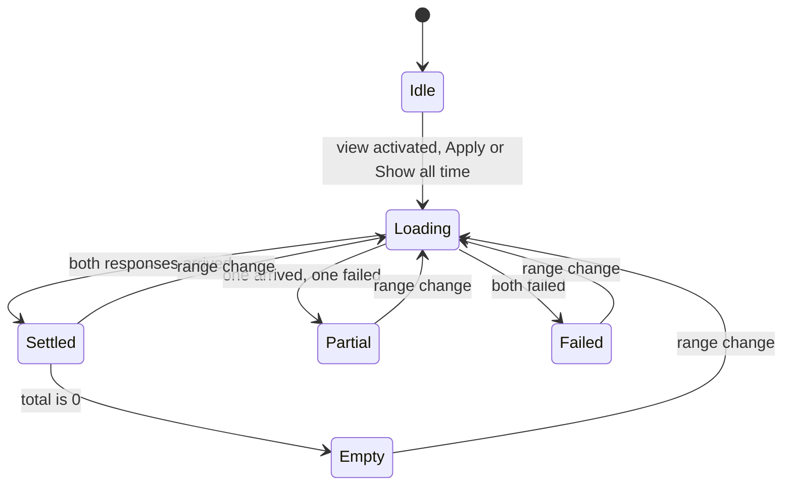

# Interaction Specification — Analytics View (Refined)

> Component-level specifications in the shape of
> `.aidlc/knowledge/aidlc-design-agent/component-spec-template.md`. Each
> component keeps the template's tables — Component / Description / Category,
> States, Props / Inputs, Responsive Behaviour, Accessibility, Usage Example — and
> adds a **Behaviour** subsection (events and their consequences) and a **Focus**
> subsection, because this stage is required to specify behaviour, keyboard
> interaction, focus and partial failure rather than markup alone.
>
> Brownfield. Every element name, class name, attribute and constant below is
> either **already in** `app/static/index.html` / `app/static/app.js` or is
> **newly named here** and declared in §14. Nothing is invented silently.

---

## 0. Conventions and cross-cutting rules

### 0.1 Rendering discipline (inherited, non-negotiable)

| Rule | Evidence |
|---|---|
| Every write is `textContent`, `createElement`, `setAttribute` or `replaceChildren`. No `innerHTML`, no template-literal HTML, no `insertAdjacentHTML` | `app.js` has no such call today; `AC6.4.4` requires native elements |
| The `<template>` clone pattern for repeated rows is reused where a row shape repeats | `app.js:77` clones `history-item`; the analytics lists use `createElement` instead because their rows are two fields, not three, and no markup source is warranted |
| Machine values are never re-derived. `total`, `counts`, `shares`, `mean_confidence` and `date` come from the response; the page formats and nothing more | `app.js:1–7` header comment states this contract for `/v1`; the same contract is extended to `/v2` |
| No value the endpoint did not return is displayed | `AC6.2.2` |
| `textContent`, never string concatenation into a node — including the SVG `points` attribute, which is built from `Number(...).toFixed(1)` per day and set with `setAttribute` | §0.1 of `mockups.md` |

### 0.2 Fetch discipline

| Rule | Detail |
|---|---|
| **Two** prefix constants, unchanged names | `API = "/v1"` stays exactly as it is (`app.js:10`, `NFR5`, `AC8.5.1`). A new `ANALYTICS_API = "/v2"` sits beside it. The analytics prefix is never written inline at a fetch site |
| **Two** fetch sites, not three | `GET ${ANALYTICS_API}/analytics/summary` and `GET ${ANALYTICS_API}/analytics/terms`. The story set says "three sections … exactly one fetch to its own endpoint" (`AC6.2.2`) while the response serves the series, the breakdown **and** the summary figures from one payload. The sections are three *render targets*; the fetch sites are two. Stated here because "three sections" and "two fetches" must not look like a contradiction later |
| Query string | `from` and `to` only, and **only when non-empty** — so a half-typed date reads as no bound, and a single bound is never dropped (`FR2.5`). `import_id` is never sent (`FR6.3`, `AC6.3.3`); `limit` is never sent (`FR3.3` default of 10 stands, `AC6.3.5`) |
| Request token | Each range change increments a counter and stamps both requests with it. A response whose token is not the current one is **discarded, not rendered** (`AC6.5.2`). This is a script code path, exempted from markup assertions by the story set's own note |
| Both responses are needed before anything renders as settled | Summary + series + breakdown come from one response; the terms come from the other. Either alone renders one half (§0.4) |
| No request other than these two is issued by the analytics view | `FR6.5`, `AC6.4.3` |

### 0.3 Validation policy

**The page does not re-implement the range rule.** It does not check that `from`
precedes `to`, and it does not pre-empt `FR2.11`'s 422s. The server owns the rule
and refuses rather than clamps; a second copy of it in the script is a second
source of truth that can drift. The user's recovery is the `Show all time`
control or a corrected date, both of which are present on the screen when the
error is.

What the page *does* do is make the resolved range visible (§0.5, the range-state
line), which removes the failure mode a validation-free design would otherwise
have: a half-typed date silently widening the query.

### 0.4 Lifecycle



Text fallback, for any reader whose renderer drops the diagram above:

- **Idle** — analytics view hidden, no analytics request in flight.
- **Loading** — a request pair is in flight. `analytics-loading` visible and
  announcing; the three data regions either hidden or showing skeletons; `Apply`
  disabled. Entered on: activation of the Analytics view, `Apply`, or
  `Show all time`.
- **Settled** — both responses arrived and both were successful. Every populated
  figure, the polyline, the breakdown and both term lists are rendered.
- **Empty** — a sub-state of `Settled`, reached when `total` is 0 **and** the
  series is empty. `analytics-empty` visible; summary, series, breakdown and term
  regions hidden.
- **Partial** — one response succeeded, the other failed. The succeeded half
  renders; `analytics-partial` is visible; the failed half's lists read
  `not loaded`; the failure message is in the one `error-panel`.
- **Failed** — both responses failed. Nothing renders; the error panel carries
  the combined message naming each failed section.
- **Every state exits to `Loading` on a range change or a re-activation, and every
  stale response is discarded on arrival (`AC6.5.2`).**
- **Fetch-on-activation is a change to existing behaviour caused by the nav
  ruling** (ruling 6): the History list and the Analytics view both currently fetch
  with the page (`app.js:193–194`), and under the view model they fetch when their
  view is activated. No story requested this and no acceptance criterion covers it
  (open point 7 in `mockups.md`).
- **The error panel's lifecycle is orthogonal to the analytics state machine** and
  is specified separately in §13.4: `clearError()` runs on every view activation,
  so this machine's `Failed`/`Partial` messages do not outlive the Analytics view.
  The panel reports the active view's most recent outcome, never a stale message
  from a view the user has left.

### 0.5 The range-state line

One `<p>` whose whole job is to state the range the **current figures** describe,
so a screen reader user, a returning user and a user with a half-typed date all
read the same sentence.

| Inputs | `analytics-range-state` text |
|---|---|
| both empty | `Showing all stored analyses (all time).` |
| `from` only | `Showing 2026-09-01 onwards, with no end date.` |
| `to` only | `Showing everything up to 2026-09-30, with no start date.` |
| both set | `Showing 2026-09-01 to 2026-09-30.` |
| a request is refused (422) | unchanged — it keeps the **last accepted** range, because the refused pair describes no population |

It is never hidden, and it is the only place the word `all time` appears.

---

## 1. Site Header

| Field | Value |
|---|---|
| Component | Site header |
| Description | The page's `banner` landmark: title, primary navigation and the connection indicator |
| Category | layout |

### States

| State | Description | Trigger |
|---|---|---|
| default | `header` containing `h1`, `nav` and the connection button | page load |
| active-view | `aria-current` on exactly one nav link | view switch |
| connected / not connected | the indicator's existing `data-connected` attribute; unchanged by this stage | `refreshConnection` (existing) |

### Behaviour

- **New.** The `h1` moves out of `<main>` into a `header`, and the connection
  button moves out of `<body>`'s top-level into it. Ruling 7.
- **The indicator loses `position: fixed`, `top`, `left` and `z-index`** from
  `.connection-indicator` and becomes an in-flow element. Its `min-height`,
  `min-width`, border, radius, colours, `background: Canvas` and
  `:focus-visible` outline are **unchanged**, and so are its `data-testid`s, its
  `id`, its `role="status"` child and every string `renderConnection` writes.
  Ruling 7; `AC5.3.2` is not disturbed.
- DOM order inside the header is `h1`, `nav`, connection button — **and the
  visual order matches it**. Nothing is repositioned with `order`, `float` or
  absolute positioning, because DOM order and visual order diverging is SC 1.3.2.
- `body`'s `padding-top: 3.5rem` existed to clear the pinned indicator. It is
  harmless now; whether to reduce it is a cosmetic call for Code Generation and is
  deliberately not specified here.

### Focus

Not a focus container. The three focusable descendants appear in DOM order:
nav → Analyze, History, Analytics → connection button.

### Accessibility

| Requirement | Implementation |
|---|---|
| ARIA role | `<header>` → implicit `banner`. Not duplicated with `role="banner"` |
| Keyboard interaction | none of its own; its children are links and a button |
| Label | none needed — the `h1` is the banner's content |
| Screen reader | announces "banner", then the `h1`, then "navigation" with the accessible name from `aria-label` |
| Focus management | none — the header is never focused programmatically |

### Usage Example

```html
<header>
  <h1>Sentiment analysis</h1>
  <nav aria-label="Views">…</nav>
  <button type="button" data-testid="connection-status" id="connection-status"
          class="connection-indicator" data-connected="false">…</button>
</header>
```

---

## 2. Primary Navigation and View Switcher

| Field | Value |
|---|---|
| Component | Primary navigation |
| Description | Three links that switch which view is visible in the single page |
| Category | navigation |

### States

| State | Description | Trigger |
|---|---|---|
| default | Analyze active; `aria-current="page"` on the Analyze link; `#analyze-view` visible, the other two `hidden` | page load, no fragment |
| history-active | `aria-current="page"` on History | fragment `#history` |
| analytics-active | `aria-current="page"` on Analytics; Analytics activation fires its first fetch | fragment `#analytics` |
| focus | UA focus ring on the focused link; no custom style added | keyboard |

### Behaviour

- **Mechanism: fragment links, `href="#analyze"` / `#history` / `#analytics`.**
  Ruling 1 calls them links and ruling 6 makes them three views in one page.
  Fragments give the views real targets, make the active view linkable, and give
  `aria-current="page"` something to refer to. The rejected alternative is a
  `<button>` per view toggling `hidden`: it needs no fragment handling and one
  less line of script, but a `<button>` that navigates is a lie about its own
  semantics, and the ruling says links.
- **No ARIA tabs.** No `role="tablist"`, `role="tab"` or `role="tabpanel"`. The
  tabs pattern carries an arrow-key and roving-tabindex contract this page would
  then have to implement and test; in-page links with `aria-current` need none.
  Named here because the interaction guidance reaches for tabs first.
- **On load and on `hashchange`:** set `hidden` on the two inactive views, remove
  it from the active one, move `aria-current` to the active link, and — for
  Analytics only — run its fetch (§3.1).
- **Every view activation first calls `clearError()`.** The single app-wide
  error panel is *owned by the active view*: a message raised by one view's data
  must not remain on screen after the user has left that view. This applies to
  all three views and both directions (analytics → Analyze/History and
  Analyze → Analytics/History); the full rule and its truth table are in §13.4.
  This is the symmetric completion of the one direction already stated in §9
  ("`clearError()` also runs when Analytics is activated").
- **Focus moves to the newly shown view container** (`tabindex="-1"`), never to
  the nav link. The nav link keeps focus when focus was already on it (mouse
  click); when a link was activated from the keyboard, focus moves into the view
  so the next `Tab` reaches the view's first control instead of re-entering the
  nav. Focus never remains on an element inside a view that has just become
  `hidden`.
- **Scroll:** the active view's heading is brought into view. No smooth-scroll
  animation is specified; `prefers-reduced-motion` is respected by not animating
  at all.
- The three links are the page's entire primary navigation: three items, well
  under the seven-item guidance ceiling, present on every view.

### Props / Inputs

| Prop | Type | Required | Default | Description |
|---|---|---|---|---|
| fragment id | string | no | `analyze` | which view the hash selects |
| `aria-current` | string | yes on the active link | `page` | which link is current; removed from the other two |

### Responsive Behaviour

| Breakpoint | Behaviour |
|---|---|
| below ≈ 392 px | the three links wrap onto two lines; no link is hidden or collapsed behind a menu, because three links fit and a hamburger would hide a two-item menu behind an extra click |
| 392 px – 520 px | three links on one line; nav spans the header's width under the title |
| above 520 px | as shipped: three links, title above them |

### Accessibility

| Requirement | Implementation |
|---|---|
| ARIA role | `<nav>` → implicit `navigation`, named by `aria-label="Views"` |
| Keyboard interaction | `Tab` reaches each link in order; `Enter` activates |
| Label / aria-label | `aria-label="Views"` distinguishes it from any future nav |
| Contrast ratio | inherited `currentColor`; UA default focus ring. No `outline: none` anywhere |
| Screen reader | the active link is announced as "current page" |
| Focus management | moves to the activated view container on keyboard activation |

### Usage Example

```html
<nav aria-label="Views" class="site-nav">
  <a href="#analyze" data-testid="nav-analyze" aria-current="page">Analyze</a>
  <a href="#history" data-testid="nav-history">History</a>
  <a href="#analytics" data-testid="nav-analytics">Analytics</a>
</nav>
```

---

## 3. Analytics View Shell

| Field | Value |
|---|---|
| Component | Analytics view |
| Description | The container that holds the date-range control and the five presentational regions |
| Category | layout |

### States

| State | Description | Trigger |
|---|---|---|
| hidden | `hidden` attribute in the served markup, so the markup is assertable before any script runs | page load when the fragment is absent or not `#analytics` |
| loading | regions 3–7 per §0.4 | activation, `Apply`, `Show all time` |
| populated | all five data regions visible | both responses 200, `total > 0` |
| empty | `analytics-empty` visible, the rest hidden | both responses 200, `total == 0` |
| partial / error | §0.4 | one or both responses failed |

### Behaviour

- `aria-labelledby` points at the view's own `h2`, following the shipped History
  section's existing pattern (`index.html:175`). The accessible name turns each
  view into a named `region` landmark, so landmark navigation reaches
  "Analyze", "History" and "Analytics" directly.
- **Fetch on activation, every time.** Not on page load, and not cached. The page
  currently calls `refreshHistory()` and `refreshConnection()` on load
  (`app.js:193–194`); under a view model the Analytics fetch waits until the user
  asks for Analytics, because firing two requests for a view nobody opened is work
  that earns nothing. Every re-activation refetches, so the numbers are never stale
  after an analysis performed in the Analyze view. **Both behaviours are changes to
  existing behaviour caused by the nav ruling (ruling 6): no story requested them
  and no acceptance criterion covers them.** The behaviour that changes is the
  History list, which currently loads with the page. Recorded as open point 7 in
  `mockups.md`.
- On entering `loading`, the previous render is cleared, not left behind.
- On leaving the view, any in-flight request is abandoned; its response is
  discarded by the token rule when it arrives.
- The view renders in the reading order the Ideation wireframes confirmed:
  range control, then summary, then series, then breakdown, then term lists.
  That order is preserved in every state.

### Focus

`tabindex="-1"`, so it is programmatically focusable but absent from the tab
order. Its internals contribute the four tab stops in §3.

### Accessibility

| Requirement | Implementation |
|---|---|
| ARIA role | `<section>` with `aria-labelledby` → implicit `region`, named by its `h2` |
| Keyboard interaction | see §3–§11 |
| Contrast ratio | all new text uses plain `currentColor`. **`opacity` is not used** on any new analytics text, unlike `.lede` and `.history-meta` which the shipped page already dims — under `color-scheme: light dark` an opacity stack cannot be contrast-checked against the UA default in either scheme |
| Screen reader | the view announces as a region named "Analytics"; state changes are announced by the `role="status"` regions in §5 and §6, not by the view |
| Focus management | receives focus on keyboard view activation |

### Usage Example

```html
<section id="analytics-view" data-testid="analytics-view"
         aria-labelledby="analytics-heading" tabindex="-1" hidden>
  <h2 id="analytics-heading">Analytics</h2>
  …regions…
</section>
```

---

## 4. Date-Range Control

| Field | Value |
|---|---|
| Component | Date-range control |
| Description | Two date inputs plus `Apply` and `Show all time`, the view's only input |
| Category | input |

### States

| State | Description | Trigger |
|---|---|---|
| unbounded | both inputs empty; range-state line reads "all time"; `Show all time` disabled | first load, ruling 5 |
| bounded | one or both inputs set | user typing or picking a date |
| focused | UA focus ring on the input | keyboard / click |
| invalid | the browser's own date picker cannot express an invalid format, so no client-side invalid state exists; a malformed or inverted range arrives as a 422 and renders in §9 | server response |
| disabled | `Apply` carries `disabled` while a request pair is in flight | `loading` |
| stale-rejected | inputs hold a pair the server refused; the range-state line keeps the last accepted range | 422 |

### Behaviour

- **Both inputs start empty** and stay empty until the user types. Ruling 5. No
  `value` attribute ships in the markup.
- **No `placeholder` attribute.** Browsers do not render `placeholder` on
  `<input type="date">`, so the placeholder mechanism was **impossible as first
  written**; the "all time" wording is carried by the range-state line (§0.5)
  instead, and **visible text beside the control was the accepted substitute**
  (Q9). The inputs stay `type="date"`, keeping the native picker and keyboard
  behaviour. See `mockups.md` §3.5 and open point 1.
- **`type="date"`,** so the value is always `YYYY-MM-DD` — exactly the format
  `FR2.4` requires — and the browser supplies a picker. The *displayed* format is
  locale-dependent; the *value* is not, and the page reads `input.value`.
- **Explicit submit only.** `Apply` is a `type="submit"` inside a `form`, so
  `Enter` in either input submits. Typing a date fires nothing — there is no
  request per keystroke and no "unexpected context change on input" (SC 3.2.2).
- **No client-side range validation** (§0.3).
- **`Show all time` is `type="button"`,** clears both inputs, re-renders the
  range-state line, and fetches with no bounds. It is `disabled` whenever both
  inputs are already empty, so the no-op cannot be activated (`AC6.3.4`).
- **`Apply` is `disabled` while a fetch pair is in flight,** mirroring the shipped
  `submitButton.disabled` idiom (`app.js:127–134`). This is `AC6.3.6`'s
  "disabled or active state … asserted as part of `US6.5`'s markup contract".
- The control lives in a `<form novalidate>`, exactly like the shipped analyze
  form, and reuses it: the page's `form` rule (`display: grid; gap: 0.5rem;
  margin: 1.5rem 0`) is an **element selector**, so it applies to this form too.
  The design accommodates it rather than weakening it — see Responsive.
- The submit handler calls `preventDefault()`, so no page navigation occurs.

### Props / Inputs

| Prop | Type | Required | Default | Description |
|---|---|---|---|---|
| `from` value | `YYYY-MM-DD` string or `""` | no | `""` | sent as `query.from` only when non-empty |
| `to` value | `YYYY-MM-DD` string or `""` | no | `""` | sent as `query.to` only when non-empty |
| `disabled` on Apply | boolean | no | `false` | true while a fetch pair is in flight |
| `disabled` on Show all time | boolean | no | computed | true when both inputs are empty |

### Responsive Behaviour

| Breakpoint | Behaviour |
|---|---|
| below ≈ 392 px | `.range-fields` is `repeat(auto-fit, minmax(12rem, 1fr))`; the two field pairs stop fitting side by side and stack, each label above its own input |
| above ≈ 392 px | the two pairs sit side by side; `.range-actions` holds both buttons on one line |
| any width | `.range-actions` uses `flex-wrap: wrap`, so the buttons wrap rather than overflow if a locale renders longer labels |

### Accessibility

| Requirement | Implementation |
|---|---|
| ARIA role | `<form>` → implicit `form` landmark, but **no accessible name is added**, because the region already announces as "Analytics" and the `h2` names it; `role="search"` and `role="group"` are not used |
| Keyboard interaction | `Tab` from/to/Apply/Show all time; `Enter` in either input submits; `Space` activates either button |
| Label / aria-label | **Two visible `<label for>` elements**, `From` and `To`, each bound to its input by `id`. No placeholder-as-label (SC 3.3.2). This is `AC6.4.5a`'s decidable assertion |
| Contrast ratio | UA default text and border colours; no `opacity` on any new text |
| Screen reader | each input announces "From, edit text, blank" or "To, edit text, blank" — `blank` is the correct announcement for an unbounded input, and the range-state line supplies the missing meaning |
| Focus management | on submit, focus **stays on `Apply`**. Moving focus to the results would fight the user's expectation that a button press leaves focus where it was, and the `role="status"` region announces the outcome |

### Usage Example

```html
<form data-testid="analytics-range-form" id="analytics-range-form" novalidate>
  <div class="range-fields">
    <div class="range-field">
      <label for="analytics-range-from">From</label>
      <input type="date" id="analytics-range-from"
             data-testid="analytics-range-from" name="from" />
    </div>
    <div class="range-field">
      <label for="analytics-range-to">To</label>
      <input type="date" id="analytics-range-to"
             data-testid="analytics-range-to" name="to" />
    </div>
  </div>
  <div class="range-actions">
    <button type="submit" id="analytics-range-apply"
            data-testid="analytics-range-apply">Apply</button>
    <button type="button" id="analytics-range-clear"
            data-testid="analytics-range-clear">Show all time</button>
  </div>
  <p id="analytics-range-state" data-testid="analytics-range-state">Showing all stored analyses (all time).</p>
</form>
```

---

## 5. Loading Region

| Field | Value |
|---|---|
| Component | Loading region |
| Description | One in-context status region announcing that the view is fetching |
| Category | feedback |

### States

| State | Description | Trigger |
|---|---|---|
| hidden | `hidden` in the served markup | default, and whenever a response pair settles |
| loading | `hidden` removed; skeletons shown in the data regions | fetch pair in flight |
| focus | never focused — it is not interactive | — |

### Behaviour

- One region announces the whole pair, because there are exactly two requests and
  neither settles independently in the common path. Per-section skeletons show
  *where* the data will land.
- Skeletons are marked `aria-hidden="true"`: a screen reader must hear the
  status sentence, not eleven meaningless rectangles.
- Skeleton styling uses the shipped plain-class vocabulary — a `.skeleton`
  class with a muted `currentColor` background, no new colour, no animation
  library, and no animation at all so `prefers-reduced-motion` is satisfied
  trivially.
- Skeletons replace the previous render rather than sitting beneath it (§0.4).

### Props / Inputs

| Prop | Type | Required | Default | Description |
|---|---|---|---|---|
| message | string | yes | `Loading analytics for this range…` | written to `textContent` on each entry into `loading`, so a repeat announcement actually re-announces |

### Responsive Behaviour

| Breakpoint | Behaviour |
|---|---|
| any width | full width of the view; the skeleton's block count matches the regions below it, collapsing from 4 rows to 1 in the breakdown |

### Accessibility

| Requirement | Implementation |
|---|---|
| ARIA role | `role="status"` **and** `aria-live="polite"` — the shipped `connection-status-text` carries both (`index.html:121–124`), and `AC6.4.5c` asks for either. Both, matching the page |
| Keyboard interaction | none |
| Label / aria-label | none; the visible sentence is the text |
| Contrast ratio | the sentence uses `currentColor`; the skeleton blocks are decorative and exempt, but still use `currentColor` so they track both colour schemes |
| Screen reader | announces "Loading analytics for this range…" on entry into `loading` |
| Focus management | none. **Focus is never moved to a loading message**; stealing focus on a refetch would strand a keyboard user |

### Usage Example

```html
<section id="analytics-loading" data-testid="analytics-loading"
         role="status" aria-live="polite" hidden>
  <p>Loading analytics for this range…</p>
  <div class="skeleton" aria-hidden="true"></div>
</section>
```

---

## 6. Empty Region

| Field | Value |
|---|---|
| Component | Empty region |
| Description | The populated view's honest answer when the range matches no rows |
| Category | feedback |

### States

| State | Description | Trigger |
|---|---|---|
| hidden | `hidden` in the served markup | any state where `total > 0` |
| empty | visible; summary, series, breakdown and both term regions `hidden` | both responses 200 with `total == 0` and `series == []` |
| focus | not itself focusable; its `Go to Analyze` link is | — |

### Behaviour

- Reached when the summary response has `total == 0` **and** an empty series.
  `FR2.10` as corrected in Requirements Revision 2 makes a no-match range return
  an empty series rather than a zero-filled one, so `total == 0` is a sufficient
  and safe trigger.
- **Nothing else renders.** No table of `0`s, no empty chart frame, no `no share`
  column. This is `NFR4`'s "a failed request never renders as a plausible-looking
  empty result" applied to an empty request: a table reading `0 / 0 / 0` beside
  `no share` three times would look like a result.
- The explanation names the cause in the user's terms and gives two actions:
  analyse some text, or widen the range above.
- `Go to Analyze` is a real fragment link, consistent with the nav, so it goes
  through the same view-switching path (§2). It is `AC6.5.4`'s "a route back to
  the existing Analyze entry", placed where the emptiness is discovered rather
  than left in the nav.
- **A 500 storage failure is not this region.** It renders in §9 with an error
  lead-in. The two are distinct elements so a test can tell them apart
  (`AC6.5.5`).

### Props / Inputs

| Prop | Type | Required | Default | Description |
|---|---|---|---|---|
| range description | string | no | from the range-state line | names the range that is empty |

### Responsive Behaviour

| Breakpoint | Behaviour |
|---|---|
| any width | the block is `max-width` bounded by the view's 46 rem column and reads as a bordered panel, reusing the shipped `section[data-testid="error-panel"]` border recipe (`1px solid currentColor; border-radius: 6px; padding: 0.75rem 1rem`) **without** the red colour |

### Accessibility

| Requirement | Implementation |
|---|---|
| ARIA role | `<section>` with `aria-labelledby` → implicit `region` named "Nothing to show" |
| Keyboard interaction | one focusable descendant, `Go to Analyze` |
| Label / aria-label | the visible `h3` names it; no `aria-label` |
| Contrast ratio | `currentColor` on the page background; no red, so the border is not colour-coded |
| Screen reader | the region announces as a named region when it appears. It is **not** a live region: an empty range is the answer the user asked for, not an event |
| Focus management | none on appearance |

### Usage Example

```html
<section id="analytics-empty" data-testid="analytics-empty"
         aria-labelledby="analytics-empty-heading" hidden>
  <h3 id="analytics-empty-heading">Nothing to show</h3>
  <p>No analyses fall inside this date range. Analytics counts stored rows, and there are none in the range above.</p>
  <p><a href="#analyze" data-testid="analytics-empty-analyze">Go to Analyze</a></p>
</section>
```

---

## 7. Summary Figures

| Field | Value |
|---|---|
| Component | Summary figures |
| Description | Two named values: how much was analysed, and how confident the calls were |
| Category | display |

### States

| State | Description | Trigger |
|---|---|---|
| hidden | `hidden` in the served markup | loading, empty, or no fetch yet |
| populated | both `<dd>`s written | 200 with `total > 0` |
| skeleton | block placeholders | loading |
| not-loaded | region visible with its heading and the marker `not loaded` in place of the `<dl>`; `analytics-partial` names it and `error-panel` carries the cause | the summary fetch failed and the terms fetch succeeded (partial failure, §13.1 step 2′) |

### Behaviour

- **Exactly two figures: `Total analyses` and `Mean confidence`.**
  `Mean intensity` is not specified because it cannot be — see `mockups.md` §1.2,
  `FR2.3`, and the shipped assertion that the word `intensity` may not appear
  anywhere in the page.
- **`mean_confidence_row_count` is deliberately not rendered.** As corrected in
  Requirements Revision 2 it always equals `total`, so a third figure would
  restate `Total analyses` and imply a denominator that cannot vary.
- **Formatting.** `total` is written verbatim from the response.
  `mean_confidence` is `Number(value).toFixed(4)` — matching the API's own
  rounding (`FR2.8` as corrected) so the page neither adds nor discards precision.
  The shipped result panel uses `.toFixed(3)` for a per-analysis confidence; using
  a different precision here is deliberate, because 3 dp would misstate a value
  the API rounded to 4.
- **A `null` mean is not displayed as a dash or a zero.** Per `FR2.8` as
  corrected, a `null` mean can only occur when `total` is 0, and that state
  routes to §6, so the combination is unreachable. If it were ever reached, the
  region would render `no value in this range` rather than a number.
- **A failed summary fetch is marked in place, not left hidden.** When the
  summary response fails and the terms response succeeds, the region keeps its
  heading and renders the marker `<p data-testid="analytics-total-not-loaded">not loaded</p>`
  in place of the `<dl>` (the `<dl>` stays `hidden`). This is the same treatment
  the term lists give their failed lists in the mirror case, so the two
  directions of partial failure read identically and `AC6.5.3`'s "marked"
  requirement is met by the region's own content rather than by the polite
  coverage line alone. §13.1's invariant — no section is ever blank without a
  stated reason — is satisfied by that marker. The summary, series and breakdown
  all come from the one failed response, so all three carry the marker together
  (§13.1 step 2′). The cause still lives in the one `error-panel`; the marker is
  a state label, not a second error message.
- Rendered as a `<dl>` of `<dt>`/`<dd>` pairs in a two-column grid, not as `<p>`
  pairs. This is a departure from the shipped result panel's
  `<p>Label: <strong>value</strong></p>` idiom, and it is deliberate: the result
  panel is a label inside prose for one outcome, whereas this is a list of named
  figures, for which `<dl>` gives each name its value's relationship without
  ARIA.
- No unit is invented. `mean_confidence` is a fraction in `[0,1]` as the API
  returns it, matching the shipped `result-confidence` which also shows a raw
  fraction.

### Props / Inputs

| Prop | Type | Required | Default | Description |
|---|---|---|---|---|
| `total` | integer | yes | — | written verbatim |
| `mean_confidence` | number in `[0,1]` \| `null` | yes | — | `.toFixed(4)`; `null` → §6 |

### Responsive Behaviour

| Breakpoint | Behaviour |
|---|---|
| any width | `grid-template-columns: max-content 1fr` keeps every label beside its own value at every width, including 320 px; a label is never separated from its number by a wrap |

### Accessibility

| Requirement | Implementation |
|---|---|
| ARIA role | `<section>` with `aria-labelledby` → implicit `region` named "Summary"; `<dl>` carries no extra ARIA |
| Keyboard interaction | none — no focusable content |
| Label / aria-label | each `<dt>` is the visible label; no `aria-label` |
| Contrast ratio | `currentColor` throughout; no `opacity`, no colour coding, no icon |
| Screen reader | "Summary, region … Total analyses, 128 … Mean confidence, 0.7125" — the `<dl>` pairing is what makes those two numbers mean anything |
| Focus management | none |

### Usage Example

```html
<section id="analytics-summary" data-testid="analytics-summary"
         aria-labelledby="analytics-summary-heading" hidden>
  <h3 id="analytics-summary-heading">Summary</h3>
  <dl class="summary-figures">
    <dt>Total analyses</dt>
    <dd id="analytics-total" data-testid="analytics-total">128</dd>
    <dt>Mean confidence</dt>
    <dd id="analytics-mean-confidence" data-testid="analytics-mean-confidence">0.7125</dd>
  </dl>
  <p id="analytics-total-not-loaded" data-testid="analytics-total-not-loaded" hidden>not loaded</p>
</section>
```

---

## 8. Per-Day Series

| Field | Value |
|---|---|
| Component | Per-day series |
| Description | A text caption, an SVG polyline of daily volume, and the full list of per-day values |
| Category | display |

### States

| State | Description | Trigger |
|---|---|---|
| hidden | `hidden` in the served markup | loading, empty, or no fetch yet |
| populated | caption + drawing + one `<li>` per entry | 200 with a non-empty `series` |
| single-point | a `<circle>` instead of a `<polyline>` | a series of exactly one entry |
| skeleton | two blocks | loading |
| not-loaded | region visible with its heading and the marker `not loaded` in place of caption + drawing + list | the summary fetch failed and the terms fetch succeeded (partial failure, §13.1 step 2′) |

### Behaviour

- **The polyline plots `total` per day**, and only `total`. One polyline was
  ruled (Q4 answer A), so one series is drawn. Per-day `counts`, `shares` and
  `mean_confidence` are present in every entry and are **not** rendered per day —
  named as an open point rather than silently dropped.
- **The list is an exact text equivalent of the plotted line, not a mirror of the
  payload.** Each `<li>` carries only `date` and `total`. `AC2.3.2` has the **API**
  return more per day (`date`, `total`, `counts`, `shares`, `mean_confidence`,
  `mean_confidence_row_count`); the view deliberately renders the subset that the
  drawing uses, so a later stage must not read the list as "everything the series
  entry holds".
- **One pass, one source.** The polyline's `points` and the `<ol>`'s `<li>`s are
  built from the same loop over the same array, so the drawing and the text cannot
  disagree. This is `AC6.4.5b`'s substance: the series is not conveyed by drawn
  geometry alone.
- **Geometry.** `viewBox="0 0 640 160"`. `x = 640 * i / (n - 1)` across the plot
  width; `y = 120 * (1 - total[i] / max(total))`, the linear map of `total` onto
  `[120, 0]` **whose domain is `[0, max(total)]`** — the ceiling is the largest
  value actually plotted, not a value rounded up beyond it. So `y(0) = 120` and
  `y(max(total)) = 0`, and the top y-axis label (see "The scale is stated"
  below) is exactly `max(total)`. The concrete `points` printed in
  `mockups.md` §3.2 are computed from this same formula with the §3.0 peak of
  `11`, so a developer building from either document gets the same line.
  Uniform spacing is correct because `FR2.9` (as corrected) guarantees a
  **continuous, zero-filled** series, so every index is exactly one day apart.
- **`n == 1` renders a `<circle>`.** A `<polyline>` with a single point draws
  nothing, which would render the one-day edge case as a blank chart.
- **`n == 0` renders no drawing at all** — the view is in §6's empty state.
- **A failed summary fetch is marked in place, not left hidden.** When the
  summary response fails and the terms response succeeds, the region keeps its
  heading and renders the marker `<p data-testid="analytics-series-not-loaded">not loaded</p>`
  in place of the caption, the `<svg>` and the `<ol>` (all three stay `hidden`).
  A drawn frame around a fetch that never returned would be the "silent blank"
  `FR6.7` rules out; the marker states why the region is empty. Same rule as
  §7 and §10, and the same rule the term lists apply in the mirror case
  (§13.1 step 2 vs step 2′).
- **The scale is stated, not implied.** The top y-axis label is the ceiling,
  and the ceiling is exactly `max(total)` — the plotted maximum, with no
  rounding up to a "nice" number — because that is the domain the `y` map above
  uses. (`mockups.md` §3.2 prints `11` for the §3.0 fixture for this reason.)
  The line is therefore readable without a hover tooltip the page has no
  mechanism for, and the top rule is the value the tallest point touches. No
  lower bound is drawn below 0, because `total` is a count and cannot be
  negative.
- **`vector-effect="non-scaling-stroke"`** keeps the stroke at 2 px at any
  rendered width, so the graphic meets SC 1.4.11 as a graphical object.
- **The caption is generated, not authored:** `Analyses per day, <first date> to
  <last date>. <n> days in range, including <k> with no analyses. Highest <v> on
  <date>.` Every clause is derived from the response; none is invented.
- **Zero-filled days are not styled differently.** Their `<li>` reads
  `0 analyses` like any other day, because `FR2.9`'s zero-fill is what makes the
  gaps visible and a separate style would add a visual channel carrying no
  information the text does not.

### Props / Inputs

| Prop | Type | Required | Default | Description |
|---|---|---|---|---|
| `series` | array of `{date, total, counts, shares, mean_confidence, mean_confidence_row_count}` | yes | — | the sole input; every rendered value comes from it |
| plotted field | — | — | `total` | fixed by ruling; not a runtime option |
| caption | string | yes | generated | text alternative for the drawing |

### Responsive Behaviour

| Breakpoint | Behaviour |
|---|---|
| any width | `width: 100%; height: auto` with the `viewBox`, so the drawing scales continuously from 320 px to 46 rem. The stroke is unaffected by the scale |
| below ≈ 392 px | the caption wraps over three to four lines; the x-axis date labels remain at both ends, which is the minimum that makes the span readable |

### Accessibility

| Requirement | Implementation |
|---|---|
| ARIA role | `<svg role="img" aria-labelledby="analytics-series-caption">`. `role="img"` makes the subtree presentational, so the three axis `<text>` labels are not announced separately and cannot double-announce |
| Keyboard interaction | none; the graphic is not interactive and no interaction is specified |
| Label / aria-label | **`aria-labelledby` to a visible caption**, not `aria-label`. A visible, translatable, assertable description is strictly better than a hidden string, and it is the long description the complex-image guidance asks for |
| Contrast ratio | `stroke="currentColor"` and `fill="currentColor"` on the text, so the graphic tracks the UA text colour in both `light` and `dark` schemes. No second colour, no gradient, no fill under the line |
| Screen reader | hears the caption, then the complete list — every date and every total — which is why the list is not `aria-hidden` |
| Focus management | none |

### Usage Example

```html
<section id="analytics-series" data-testid="analytics-series"
         aria-labelledby="analytics-series-heading" hidden>
  <h3 id="analytics-series-heading">Per-day series</h3>
  <p id="analytics-series-caption" data-testid="analytics-series-caption">Analyses per day, 2026-09-01 to 2026-09-30. 30 days in range, including 5 with no analyses. Highest 11 on 2026-09-16.</p>
  <svg class="series-chart" data-testid="analytics-series-chart"
       role="img" aria-labelledby="analytics-series-caption" viewBox="0 0 640 160">
    <polyline data-testid="analytics-series-line" fill="none" stroke="currentColor"
              stroke-width="2" vector-effect="non-scaling-stroke" points="…"></polyline>
  </svg>
  <ol class="series-values" id="analytics-series-values"
      data-testid="analytics-series-values"></ol>
  <p id="analytics-series-not-loaded" data-testid="analytics-series-not-loaded" hidden>not loaded</p>
</section>
```

---

## 9. Reused Error Panel (analytics use)

| Field | Value |
|---|---|
| Component | Error panel |
| Description | The page's single error surface, now shared by the analyze flow and the analytics view |
| Category | feedback |

### States

| State | Description | Trigger |
|---|---|---|
| hidden | `hidden` in the served markup, empty text | default, and after `clearError()` |
| analyze-error | existing behaviour, unchanged | `/v1` failure |
| analytics-validation | 422 from either analytics endpoint | malformed or inverted range |
| analytics-storage | 500 from either analytics endpoint | storage failure |
| analytics-partial | one endpoint failed, the other succeeded | §6 |
| analytics-total | both endpoints failed | §6 |

### Behaviour

- **Reused, not duplicated.** Ruling 2. The same
  `section[data-testid="error-panel"]`, the same `id`, the same `role="alert"`,
  the same red border recipe. There is no analytics-specific error element, and
  `showError` / `clearError` from `app.js:42–50` are reused as they stand.
- **It lives above the three views** as a direct child of `<main>`, so a failure
  raised while Analytics is visible is not pushed below the fold and a failure
  raised from Analyze is not trapped inside the Analyze view.
- **The analytics path does not reuse `readErrorMessage`'s composition.** That
  helper prefixes the machine code (`app.js:30–40`), so the **shipped Analyze flow
  already shows a machine code to the user** — the wireframes' "never show raw
  error codes" was never true of this page. The analytics path therefore makes a
  **deliberate divergence from shipped behaviour** (not merely from the
  wireframes): it composes its own string — a **status-derived lead-in** plus
  `payload.message`, with no machine code.
  - `422` → `The date range was refused.`
  - `500` → `The analytics query failed.`
  - anything else → `The analytics request failed.`
  This is what makes `AC6.4.2` visible rather than merely true of the response:
  a 422 and a 500 read differently on screen, and neither reads as an empty
  result.
- **One endpoint failed** → that endpoint's section is named in the message and
  `analytics-partial` reports coverage.
- **Both endpoints failed** → the message names both sections and both reasons,
  joined, so one panel holds one coherent statement.
- **`clearError()` runs at the start of every analytics fetch**, so a resolved
  failure does not linger beside fresh data.
- **`clearError()` also runs on every view activation**, because an error raised
  by a previous view is not this view's error to display. The rule is symmetric:
  it clears an analytics error when the user leaves Analytics, and it clears an
  analyze or history error when the user leaves those views. The panel is
  app-wide (it lives above all three views), but it reports only the **current**
  view's most recent outcome; a stale message from another view is never visible
  on the current one. Re-activating Analytics refetches, so if the failure
  persists the panel is re-raised with a fresh message rather than left empty.
  The full lifecycle, including both directions and the Analyze↔History case, is
  in §13.4.

### Props / Inputs

| Prop | Type | Required | Default | Description |
|---|---|---|---|---|
| status | number | yes | — | selects the lead-in |
| `message` | string | yes | — | the envelope's `message`, verbatim, never rewritten |
| failed sections | string list | no | — | named when one or both fetches failed |

### Responsive Behaviour

| Breakpoint | Behaviour |
|---|---|
| any width | unchanged from shipped: a full-width bordered block with `1rem` inline padding. Long messages wrap; nothing is truncated |

### Accessibility

| Requirement | Implementation |
|---|---|
| ARIA role | `role="alert"`, unchanged. Assertive by implication, which is correct: a failed query is the thing the user most needs to hear |
| Keyboard interaction | none — the panel is not focusable and moving focus to it would steal focus from the range control the user is still editing |
| Label / aria-label | none; it is a live region whose content is the message |
| Contrast ratio | shipped `#b00020` on the page background. `#b00020` on white is about 6.6:1; on a dark canvas it is lower, and that is the **shipped** choice, inherited unchanged. It is a 1.4.3 item a later stage should verify in dark mode — named in §13, not silently re-coloured |
| Colour independence | the message **text** carries the failure; the red border is redundant. SC 1.4.1 is met by the words, not the colour |
| Screen reader | announces on `textContent` assignment. Because it is a single shared region, an analytics error replaces an analyze error rather than queueing behind it |
| Focus management | none |

### Usage Example

```html
<!-- Reused verbatim from app/static/index.html:153. Not a new element. -->
<section data-testid="error-panel" id="error-panel" role="alert" hidden></section>
```

---

## 10. Label Breakdown Table

| Field | Value |
|---|---|
| Component | Label breakdown |
| Description | A real three-column table of count and share per label |
| Category | display |

### States

| State | Description | Trigger |
|---|---|---|
| hidden | `hidden` in the served markup | loading, empty, or no fetch yet |
| populated | three `<tr>`s in `LABEL_ORDER` | 200 with `total > 0` |
| mixed | some shares `null`, others real — only reachable if the API ever changes; today `null` implies `total == 0`, which routes to §6 | — |
| skeleton | three blocks | loading |
| not-loaded | region visible with its heading and the marker `not loaded` in place of the `<table>` | the summary fetch failed and the terms fetch succeeded (partial failure, §13.1 step 2′) |

### Behaviour

- **A real `<table>`,** not a grid of divs. `<caption>`, `<thead>` with
  `<th scope="col">`, and one `<tbody>` the script fills. `AC6.4.4` requires native
  elements, and the interaction guidance is explicit that tabular data belongs in
  a table.
- **Row order is `positive, negative, neutral`**, from the shipped `LABEL_ORDER`
  (`app.js:9`) — the same order the result panel's `.probabilities` list already
  uses. The wireframes drew `positive, neutral, negative`; that is corrected, so
  the three labels never appear in two orders on one page.
- **Share rendering.**
  - non-`null` share → `Number(share * 100).toFixed(2) + " %"`.
    `0.01 %` is exactly the API's 4-dp fraction, so nothing is invented and
    nothing is lost. A space before `%` keeps it a value and not a unit glued to
    a number.
  - `null` share → the literal string **`no share`**. Never `0%`, never `0.00%`,
    never an em dash, never an empty cell. `AC6.2.5`.
  - A share that is genuinely `0.0` renders `0.00 %` and is **not** a `null`
    share. This distinction is the whole point of the rule.
- **No bar column** (`mockups.md` §1.5). No "total share" row, because the three
  independently rounded percentages sum to 99.99 % and a reconciling row would
  have to either lie or duplicate the rounding rule.
- **No row for a label the response omitted.** The three rows are iterated from
  `LABEL_ORDER`, so `counts[label] === undefined` must render as `null` rather
  than `NaN` — the refuse-never-substitute rule again.
- **A failed summary fetch is marked in place, not left hidden.** When the
  summary response fails and the terms response succeeds, the region keeps its
  heading and renders the marker `<p data-testid="analytics-breakdown-not-loaded">not loaded</p>`
  in place of the `<table>` (the `<table>` stays `hidden`). A table of
  `0 / no share` would be a plausible-looking answer to a question that was never
  answered, which is exactly the failure `NFR4` and `AC6.5.3` forbid; the marker
  states the reason instead. Same rule as §7 and §8.
- The `<caption>` is generated and carries the range, so the table is
  self-describing when read out of context by a table-navigation user.

### Props / Inputs

| Prop | Type | Required | Default | Description |
|---|---|---|---|---|
| `counts` | object keyed by label | yes | — | one column |
| `shares` | object keyed by label, values number in `[0,1]` or `null` | yes | — | the other column |
| `LABEL_ORDER` | existing constant | yes | `["positive","negative","neutral"]` | row order |

### Responsive Behaviour

| Breakpoint | Behaviour |
|---|---|
| any width | `width: 100%`, three columns, no horizontal scroll down to 320 px |
| below ≈ 392 px | numeric cells use `font-variant-numeric: tabular-nums` so the three percentages align on the decimal without padding tricks |

### Accessibility

| Requirement | Implementation |
|---|---|
| ARIA role | native `<table>`; no `role` attribute, because adding one is the classic ARIA misuse |
| Keyboard interaction | none; tables are not focusable |
| Label / aria-label | `<caption>` (visible, generated from the range) plus three `<th scope="col">`. Every `<td>` has an accessible name of its own text; no `aria-label` on cells |
| Contrast ratio | `currentColor`; the bar glyph that the wireframes drew is gone, so there is no graphical object to check |
| Screen reader | announces "Counts and shares by label for the selected range, table with 3 columns and 3 rows … positive, 66, 51.56 %" — the count and the share are separable, which a single merged "66 (51.56 %)" cell would not be |
| Focus management | none |

### Usage Example

```html
<section id="analytics-breakdown" data-testid="analytics-breakdown"
         aria-labelledby="analytics-breakdown-heading" hidden>
  <h3 id="analytics-breakdown-heading">Label breakdown</h3>
  <table class="breakdown-table">
    <caption>Counts and shares by label for the selected range.</caption>
    <thead>
      <tr><th scope="col">Label</th><th scope="col">Count</th><th scope="col">Share</th></tr>
    </thead>
    <tbody id="analytics-breakdown-rows" data-testid="analytics-breakdown-rows"></tbody>
  </table>
  <p id="analytics-breakdown-not-loaded" data-testid="analytics-breakdown-not-loaded" hidden>not loaded</p>
</section>
```

---

## 11. Term Lists

| Field | Value |
|---|---|
| Component | Term lists |
| Description | Two ordered lists of the most frequent significant terms, one per polarity |
| Category | display |

### States

| State | Description | Trigger |
|---|---|---|
| hidden | `analytics-terms` carries `hidden` in the served markup | loading, empty, or a failed terms fetch |
| populated-both | two non-empty lists | 200 with terms for both polarities |
| populated-one | one list filled, the other's empty-message shown | an all-positive or all-negative range (`AC4.1.6`) |
| empty-both | both empty-messages shown | no positive and no negative rows in range |
| skeleton | two blocks | loading |
| not-loaded | `analytics-terms` stays hidden; §6 names it and the two lists read `not loaded` | partial failure |

### Behaviour

- **Two `<ol>`s** — real ordered lists, because rank is the meaning — each with
  its own `<h4>` and each inside a plain container. `h3` (`Top terms`) then `h4`
  per polarity keeps the heading levels unbroken from the page's single `h1`.
- **The API's order is the rendered order.** `FR3.5` fixes count descending with
  alphabetical tie-break, so the script appends in response order and does not
  re-sort. A client-side sort would risk re-implementing the tie-break and
  disagreeing with it.
- **Top 10 per list, always.** The page sends no `limit`, so the server's default
  of 10 applies (`FR3.3`, `AC6.3.5`). There is no limit control, and there is no
  "show more": a control would let the page present a population the summary
  figures do not describe.
- **Each row reads `<term>` then the count**, e.g. `delivery` and `12`. The count
  is written as text with no parentheses-only decoration, so the pair survives a
  screen reader's flat reading. The existing `.probabilities` items use
  `label: 0.615` and the same shape is followed here.
- **An empty list gets a sentence**, not a silent gap and not the wireframes'
  `( none )`: `No positive terms in this date range.` / `No negative terms in
  this date range.` It is a `<p>` sibling, `hidden` when the list has rows, so the
  region is never an empty `<ol>` with no guidance.
- **`neutral` contributes to neither list** and is never shown as a third list
  (`FR3.6`, `AC3.2.2`). The view therefore has no place to display it, and does
  not invent one.
- **A term the response did not return is not displayed.** An empty response list
  is an empty list; the page never fills a list to make it look balanced.
- Both lists come from **one** fetch. The two `not loaded` markers in §7's
  partial-failure screen appear together, because the terms either arrive or they
  do not.

### Props / Inputs

| Prop | Type | Required | Default | Description |
|---|---|---|---|---|
| `positive` | array of `{term, count}` | yes | — | appended in order; an empty array shows the empty message |
| `negative` | array of `{term, count}` | yes | — | as above |
| `limit` | — | — | not sent | server default 10 |

### Responsive Behaviour

| Breakpoint | Behaviour |
|---|---|
| above ≈ 520 px | the two lists sit side by side in `repeat(auto-fit, minmax(16rem, 1fr))` |
| below ≈ 520 px | they stack, positive above negative, preserving the DOM and therefore the reading order |

### Accessibility

| Requirement | Implementation |
|---|---|
| ARIA role | native `<ol>` inside a `<section aria-labelledby>`. No `role="list"` re-declaration — the shipped `#history-list` sets `list-style: none`, and where a list-style is removed the list role is restored by `role="list"` on the `<ol>` so a browser that strips list semantics still exposes one |
| Keyboard interaction | none |
| Label / aria-label | each `<h4>` is the visible label; no `aria-label` |
| Contrast ratio | `currentColor`; rank is carried by the `<ol>`'s numbers, not by size, weight or colour |
| Screen reader | "Positive texts, heading level 4 … list, 10 items … delivery, 12" |
| Focus management | none |

### Usage Example

```html
<section id="analytics-terms" data-testid="analytics-terms"
         aria-labelledby="analytics-terms-heading" hidden>
  <h3 id="analytics-terms-heading">Top terms</h3>
  <p>Most frequent terms, up to 10 per list, for the selected range.</p>
  <div class="term-lists">
    <div>
      <h4>Positive texts</h4>
      <ol id="analytics-positive-terms" role="list"
          data-testid="analytics-positive-terms"></ol>
      <p id="analytics-positive-terms-empty" data-testid="analytics-positive-terms-empty" hidden>No positive terms in this date range.</p>
    </div>
    <div>
      <h4>Negative texts</h4>
      <ol id="analytics-negative-terms" role="list"
          data-testid="analytics-negative-terms"></ol>
      <p id="analytics-negative-terms-empty" data-testid="analytics-negative-terms-empty" hidden>No negative terms in this date range.</p>
    </div>
  </div>
</section>
```

---

## 12. Partial-Failure Status Region

| Field | Value |
|---|---|
| Component | Partial-failure status region |
| Description | A polite one-line statement of how much of the view loaded |
| Category | feedback |

### States

| State | Description | Trigger |
|---|---|---|
| hidden | `hidden` in the served markup | default, and when both responses succeeded |
| partial | visible; names the count of sections shown and the section that did not | exactly one response failed |
| not-loaded | text inside each failed section's data position | same trigger |

### Behaviour

- **This is the one place where two requirements pull against each other**, and
  the resolution is on the record. `AC6.5.3` requires the successful section to
  render and the failed one to be marked; `AC6.5.5` requires the partial state to
  be a distinct region; ruling 2 requires **one error surface app-wide** and
  forbids a second error panel.
- Resolution: **the failure message still goes to `error-panel`.** What this
  region adds is a *coverage* statement — `Showing 2 of 3 sections for this
  range. The term lists could not be read.` — carried politely rather than
  assertively, because the alert has already said the failure. It is not an error
  panel, has no red border, and states no cause of its own; it is the region
  `AC6.5.5` asks to be separately assertable.
- **The failed half is marked in place, in both directions.** Each failed
  section keeps its heading and shows a `<p>` reading **`not loaded`** where its
  data would be, with the data element itself `hidden`:
  - summary fails → `analytics-summary` shows `analytics-total-not-loaded`,
    `analytics-series` shows `analytics-series-not-loaded`, and
    `analytics-breakdown` shows `analytics-breakdown-not-loaded`; the term lists
    render (§13.1 step 2′).
  - terms fail → `analytics-terms`' two list positions show `not loaded`; the
    summary, series and breakdown render (§13.1 step 2).
  This is the `AC6.5.3` "marked" requirement discharged by the failed regions'
  own content, so no failed region is ever blank; the coverage line is a summary
  of that, not the only statement of it. A list or table that was never populated
  is empty, and the page does not leave an empty `<ol>`, `<dl>` or `<table>`
  unexplained.
- When **both** responses fail this region stays hidden and `error-panel` carries
  the whole failure; there is nothing "partially" shown to account for, and the
  three summary regions stay `hidden` too (there is no successful half to
  contrast a marker against).
- Named as an open point (`mockups.md` §9 item 2), because a reviewer could
  reasonably read it as the second error surface ruling 2 forbids. If the human
  rules it out, the coverage sentence moves into `error-panel`'s message text and
  this element disappears — at the cost of `AC6.5.5`.

### Props / Inputs

| Prop | Type | Required | Default | Description |
|---|---|---|---|---|
| shown count | integer | yes | — | sections rendered |
| failed labels | string list | yes | — | region headings, written in the page's own words (`The term lists…`) |

### Responsive Behaviour

| Breakpoint | Behaviour |
|---|---|
| any width | a single `<p>`; wraps to two lines on a narrow viewport. Never truncated |

### Accessibility

| Requirement | Implementation |
|---|---|
| ARIA role | `role="status"` with `aria-live="polite"` — polite, not assertive, because the failure itself is already announced by the alert |
| Keyboard interaction | none |
| Label / aria-label | none |
| Contrast ratio | `currentColor`; no red, because this region reports coverage rather than failure |
| Screen reader | announces once on appearance, after the alert, without interrupting |
| Focus management | none |

### Usage Example

```html
<section id="analytics-partial" data-testid="analytics-partial"
         role="status" aria-live="polite" hidden>
  <p>Showing 2 of 3 sections for this range. The term lists could not be read.</p>
</section>
```

---

## 13. Cross-component behaviour

### 13.1 Partial failure, end to end

| Step | Summary fetch | Terms fetch | What renders |
|---|---|---|---|
| 1 | in flight | in flight | loading region; skeletons; `Apply` disabled |
| 2 | 200 | 500 | summary, series and breakdown render from the 200. `analytics-partial` names the term lists. Both term lists read `not loaded`. `error-panel` carries the 500 lead-in plus the envelope message |
| 2' | 500 | 200 | the reverse: summary, series and breakdown each keep their heading and read `not loaded` in place of their data (`analytics-total-not-loaded`, `analytics-series-not-loaded`, `analytics-breakdown-not-loaded`); `analytics-partial` names them (in place of the term lists); the term lists render; `error-panel` carries the 500 lead-in plus the envelope message |
| 2'' | 422 | 422 | nothing renders; `error-panel` carries one combined message naming both sections and both reasons. `analytics-partial` stays hidden |
| 3 | user presses `Show all time` | | `clearError()`, `analytics-partial` hidden, back to step 1 |

Two invariants hold throughout: **no section ever shows figures from a superseded
range** (the token rule), and **no section is ever blank without a stated
reason** (loading, empty, `not loaded`, or the error panel). Those two together
are `AC6.5.3`.

### 13.2 What is deliberately *not* implemented

| Not built | Why |
|---|---|
| Client-side range validation | §0.3 — the server owns the rule |
| A `limit` control | `AC6.3.5` ruled; the list always shows the affirmed top 10 |
| An `import_id` control | `FR6.3`, `AC6.3.3` — API-only, so the page can never present a population it cannot label |
| Sorting or filtering of the breakdown | The order is the shipped `LABEL_ORDER`; a control would let the two labels disagree between the breakdown and the term lists |
| A chart library, a tooltip, an animation | `FR6.6`, `NFR6`, and the two-runtime-dependency cap |
| An analytics-specific error panel | ruling 2 |
| Per-day `counts`, `shares`, `mean_confidence` in the text list | open point 3 in `mockups.md`; the list is an exact text equivalent of the plotted line as specified |
| A "total share" row | §10 — independently rounded percentages cannot be reconciled without a second rounding rule |

### 13.3 Carried forward for verification, not decided here

| Item | Why it is not decided in this spec |
|---|---|
| `#b00020` on a dark canvas in the error panel | Inherited unchanged from the shipped file; changing it is a contrast decision about existing styling, not about this feature |
| 44 × 44 touch targets | The new buttons inherit the shipped `padding: 0.5rem 1rem`, which is under the guidance figure. Meeting it means a rule that also changes the existing Analyse button — out of this feature's scope, and SC 2.5.5 is AAA, not AA |
| UA default focus-ring contrast | The page sets `outline: none` nowhere and specifies focus only for the connection indicator. Verifying the UA ring at 3:1 (SC 1.4.11) is a verification task, not a design decision |

### 13.4 Error-panel lifecycle across views

The panel is **one element reused by all three views** (ruling 2, "single
surface"), sitting above them so it is visible from whichever view is active.
Reuse creates one hazard: because the same node is never re-created, a message
left by one view is still painted when another view is shown. The lifecycle rule
below closes it. The design principle it encodes: **the panel reports the active
view's most recent outcome, never a stale message from a view the user has left.**

**The rule.** `clearError()` runs on **every view activation** — all three views,
both directions — and again at the start of every analytics fetch. A view then
raises its own error if its own data fails. There is no path by which view A's
message is visible while view B is active.

| From → to | Panel on the incoming view | Why |
|---|---|---|
| Analytics (error shown) → Analyze | `clearError()` on activation; panel `hidden` and empty | the failed analytics fetch is not Analyze's message to carry |
| Analytics (error shown) → History | `clearError()` on activation; panel `hidden` and empty | History has no fetch of its own to raise a message |
| Analytics (error shown) → Analytics (re-activation) | `clearError()` then a fresh fetch; panel re-raises iff the failure persists | re-activation refetches, so the outcome is current, not stale |
| Analyze (error shown) → Analytics | `clearError()` on activation, then the analytics fetch; panel shows the analytics outcome, not the analyze one | the analytics fetch owns the panel from activation onward |
| Analyze (error shown) → History | `clearError()` on activation; panel `hidden` and empty | neither view's data raised it on History |
| History (no error) → Analytics | `clearError()` (no-op, panel already empty), then the fetch | — |

Corollaries the implementation must honour:

- `clearError()` is the **only** way the panel is emptied; every activation path
  calls it, including a same-view re-activation (`hashchange` that resolves to the
  view already showing).
- Clearing the panel and abandoning in-flight work are the same event on leaving
  Analytics: the outgoing view's request is discarded by the token rule (§0.2),
  and its response can therefore never repaint the panel after the switch.
- `analytics-partial` and the `not-loaded` markers are **not** touched by a view
  switch except through §0.4's loading transition; they are per-analytics-view
  state and are hidden when the Analytics view is hidden.
- The nav switch itself never writes to the panel; it calls `clearError()` and
  lets the incoming view's own code decide what, if anything, to display.
- This rule is symmetric with, and the completion of, the single direction
  already recorded in §9 ("`clearError()` also runs when Analytics is
  activated"); §9 now points here for the full lifecycle.

---

## 14. New markup hooks declared by this stage

`AC6.1.2` requires these hooks to be named at Refined Mockups and added to the
pinned constant in `tests/test_page.py` — the same `REQUIRED_TEST_IDS` tuple the
existing page tests already assert, not a new pinning style. `AC6.2.4` requires
every one of them to be asserted in the existing style.

**34 new hooks, all joining `REQUIRED_TEST_IDS` (which becomes 48 entries).**
(The original count was 31; the three `*-not-loaded` markers below were added when
the summary-failure direction of partial failure was specified to mark its failed
regions in place, matching the term lists.)

| Hook | Element | Asserts | Serves |
|---|---|---|---|
| `nav-analyze` | `<a>` | the first view's entry exists | `AC6.1.1` |
| `nav-history` | `<a>` | History is a *nav entry*, not a bare section | `AC6.1.1`, ruling 1 |
| `nav-analytics` | `<a>` | the third top-level entry exists | `AC6.1.1`, `FR6.1` |
| `analyze-view` | `<section>` | the view wrapper exists; `hidden` toggles | ruling 6 |
| `history-view` | `<section>` | History became a view, heading not duplicated | ruling 6 |
| `analytics-view` | `<section>` | the analytics container exists | `AC6.2.1`, `FR6.1` |
| `analytics-range-form` | `<form>` | a form, so `Enter` submits | §4 |
| `analytics-range-from` | `<input>` | the `from` control exists and is unvalued | `AC6.4.5a`, `AC6.3.1` |
| `analytics-range-to` | `<input>` | the `to` control exists and is unvalued | `AC6.4.5a`, `AC6.3.1` |
| `analytics-range-apply` | `<button>` | the submit control exists and can carry `disabled` | `AC6.3.6` |
| `analytics-range-clear` | `<button>` | a way back to the default exists | `AC6.3.4` |
| `analytics-range-state` | `<p>` | the unbounded state is stated in the markup, not invented | `AC6.3.1`, ruling 5 |
| `analytics-loading` | `<section>` | loading is a distinct region with a status role | `AC6.5.1`, `AC6.5.5`, `AC6.4.5c` |
| `analytics-empty` | `<section>` | empty is a distinct region from error | `AC6.4.1`, `AC6.5.5` |
| `analytics-empty-analyze` | `<a>` | a route back to Analyze from the empty state | `AC6.5.4` |
| `analytics-partial` | `<section>` | partial failure is a distinct region | `AC6.5.3`, `AC6.5.5` |
| `analytics-summary` | `<section>` | the summary container exists | `FR6.2` |
| `analytics-total` | `<dd>` | total is its own addressable figure | `FR2.3` |
| `analytics-mean-confidence` | `<dd>` | the mean is addressable, and separate from total | `FR2.3`, `FR2.8` |
| `analytics-total-not-loaded` | `<p>` | a failed summary fetch is marked in place, not left blank | `AC6.5.3` |
| `analytics-series` | `<section>` | the series container exists | `AC6.2.1` |
| `analytics-series-caption` | `<p>` | a visible long description exists for the drawing | `AC6.4.5b`, `FR6.8` |
| `analytics-series-chart` | `<svg>` | a native SVG drawing, no library | `FR6.6`, `AC6.4.4` |
| `analytics-series-line` | `<polyline>` | the line element, and its absence in the one-day case | ruling 4 |
| `analytics-series-values` | `<ol>` | the per-day values are present as text | `AC6.4.5b` |
| `analytics-series-not-loaded` | `<p>` | a failed summary fetch marks the series in place | `AC6.5.3` |
| `analytics-breakdown` | `<section>` | the breakdown container exists | `AC6.2.1` |
| `analytics-breakdown-rows` | `<tbody>` | a real table body to fill; row count is then assertable | `AC6.4.4`, `FR6.6` |
| `analytics-breakdown-not-loaded` | `<p>` | a failed summary fetch marks the breakdown in place | `AC6.5.3` |
| `analytics-terms` | `<section>` | the term container exists | `AC6.2.1` |
| `analytics-positive-terms` | `<ol>` | the positive list exists | `AC6.2.1`, `FR6.2` |
| `analytics-positive-terms-empty` | `<p>` | an empty positive list is explained | `AC3.1.4`, `AC4.1.5` |
| `analytics-negative-terms` | `<ol>` | the negative list exists | `AC6.2.1`, `FR6.2` |
| `analytics-negative-terms-empty` | `<p>` | an empty negative list is explained | `AC3.1.4`, `AC4.1.6` |

**No per-row hooks are added**, deliberately. `history-item-text` and
`history-item-meta` are the two hooks the shipped page deliberately leaves
unpinned, because they are inside a `<template>` and never appear in served
markup. (`REQUIRED_TEST_IDS` currently pins **14** of the page's 16 hooks — the
two unpinned are exactly those two; not 12, as the dispatch brief stated. The
`<template data-testid="history-item">` itself lives inside `<main>`.) Rows the
script creates at runtime are in the same position: nothing executes `app.js`
(`NFR7`), so a per-row hook could never be asserted and would be an untestable
promise. Row presence is assertable from the parent (`analytics-series-values`,
`analytics-breakdown-rows`, the two term `<ol>`s).

### 14.1 The `/v2` prefix and how it is pinned

`AC6.2.3` requires a static assertion that the prefix the frontend fetches
matches the router's, and the brief requires this spec to state how the
`API = "/v1"` split is handled.

| Item | Specification |
|---|---|
| Frontend constants | `const API = "/v1"` **unchanged** at `app.js:10`, still used by `/analyze`, `/analyses` and `/health`. A sibling `const ANALYTICS_API = "/v2"` is added beside it. The analytics prefix is never inlined at a fetch site |
| Backend constant | the `/v2` router carries its own prefix constant beside `v1_router = APIRouter(prefix=V1_PREFIX)` at `app/routes.py:134` |
| The pin | a static assertion compares the two constants' values. Both live in source files the suite already reads, so it is decidable **without** executing `app.js` or a browser — which is the whole reason `AC6.2.3` was written as a static check |
| Why this is the cheapest real check | the frontend's copy of the prefix is asserted by nothing today. A backend prefix change that is not mirrored in the script would otherwise surface only as a 404 in the browser, which no test in this repository can see |
| Why it is not `"/v2/analytics"` as a constant | the version prefix is the thing that drifts; the path segments are the endpoint's identity and belong at the fetch sites, matching how `/analyze` and `/health` are written today |

The exact form of the assertion is Code Generation's. The **design** constraints
are that the prefix lives in exactly one frontend constant, that it is named in a
comment as the mirror of the router's, and that `API` is untouched so `/v1`
behaviour cannot shift (`NFR5`, `AC8.5.1`, `AC8.5.2`).
